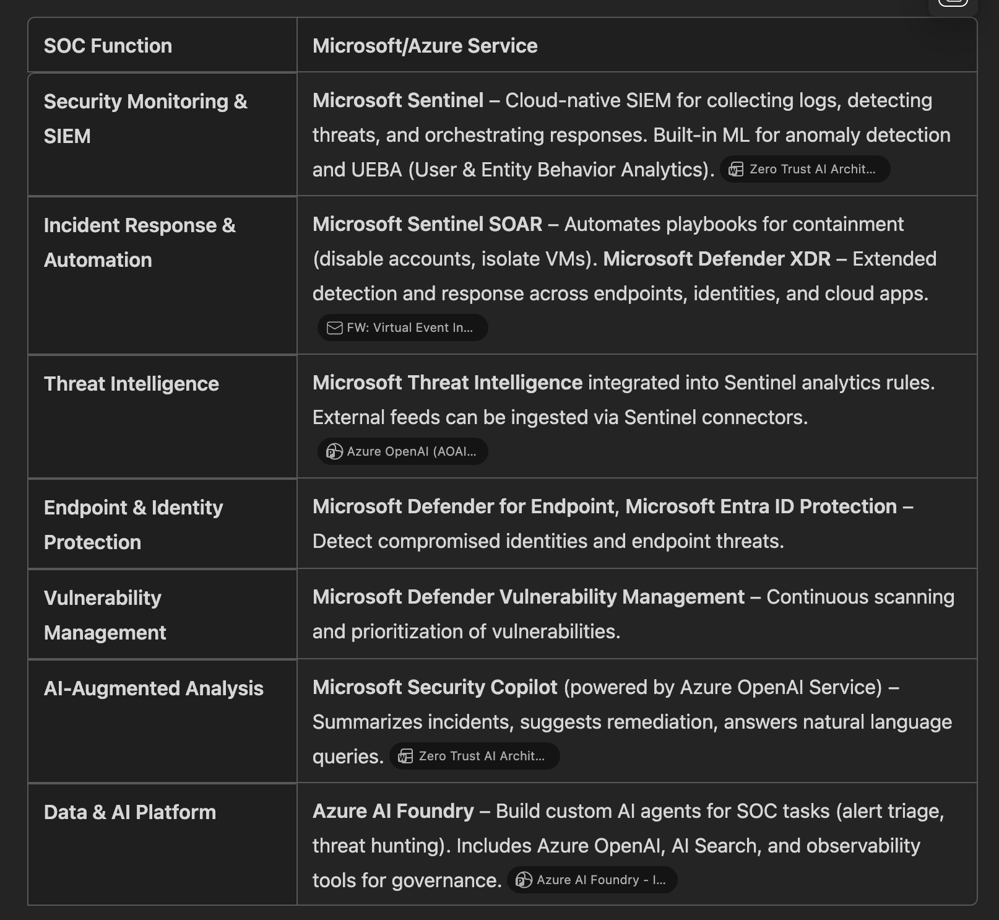

### Architecture: Agentic SOC on Azure

+---------------------------------------------------------------+
|                        Agentic SOC Layer                     |
|---------------------------------------------------------------|
|  AI Agents (Azure AI Foundry)                                |
|   • Alert Triage Agent (Sentinel + OpenAI)                   |
|   • Threat Hunting Agent (KQL + ML)                          |
|   • Incident Response Agent (SOAR + Copilot)                 |
|   • Threat Intel Agent (Azure AI Search + Feeds)             |
|                                                               |
|  Orchestration & Reasoning                                   |
|   • Multi-Agent Coordinator (Azure Functions / Logic Apps)   |
|   • Knowledge Graph (Azure Cosmos DB)                        |
+---------------------------------------------------------------+
        ↓
+---------------------------------------------------------------+
|           Microsoft Security Stack (Data & Actions)          |
|---------------------------------------------------------------|
|  Microsoft Sentinel (SIEM + SOAR)                            |
|  Microsoft Defender XDR (Endpoints, Identity, Cloud Apps)    |
|  Microsoft Entra ID Protection                               |
|  Defender Vulnerability Management                           |
|  Threat Intelligence Feeds                                   |
+---------------------------------------------------------------+
        ↓
+---------------------------------------------------------------+
|                Azure Platform & AI Services                  |
|---------------------------------------------------------------|
|  Azure OpenAI Service (GPT for reasoning & summaries)        |
|  Azure Machine Learning (Predictive models)                  |
|  Azure AI Search (Threat intel enrichment)                   |
|  Azure Monitor / Log Analytics                               |
+---------------------------------------------------------------+
        ↓
+---------------------------------------------------------------+
|                Governance & Compliance Layer                 |
|---------------------------------------------------------------|
|  Azure Policy, Microsoft Purview, Responsible AI             |
+---------------------------------------------------------------+

### ✅ Mapping SOC Functions to Microsoft & Azure Services

### AI Ideation: How to Improve Existing Capabilities

1. Agentic AI for Alert Triage

Current State: Sentinel uses ML for anomaly detection and basic alert correlation.
Opportunity: Build multi-agent systems using Azure AI Foundry to:

Auto-classify alerts by severity and context.
Assign tasks to specialized AI agents (e.g., phishing analysis agent, lateral movement detection agent).
Use Security Copilot for natural language summaries and prioritization.

2. Proactive Threat Hunting

Current State: Manual hunts via Sentinel queries.
Opportunity: Deploy autonomous hunting agents:

Use Azure OpenAI + KQL to generate dynamic hunting queries.
Integrate Microsoft Graph Security API for cross-domain correlation.
Agents can continuously scan for patterns (e.g., credential misuse) and suggest hunts.

3. Incident Response Acceleration

Current State: SOAR playbooks triggered by rules.
Opportunity: Add reasoning agents:

AI evaluates incident context and dynamically selects the best playbook.
Suggest containment steps in natural language via Security Copilot.
Predict escalation risk using historical data and ML models.

4. Threat Intelligence Fusion

Current State: Manual ingestion of feeds.
Opportunity: Use Azure AI Search + OpenAI:

Summarize threat intel reports and auto-update Sentinel detection rules.
Create an AI-driven IOC enrichment pipeline that correlates external intel with internal telemetry.

5. SOC Knowledge Base & Analyst Copilot

Current State: Tribal knowledge in docs.
Opportunity: Train Copilot Studio on historical incidents:

Analysts can ask: “Have we seen this malware before?”
AI retrieves past cases and remediation steps instantly.

6. Predictive SOC

Current State: Reactive detection.
Opportunity: Use Azure Machine Learning for predictive analytics:

Forecast attack likelihood based on telemetry trends.
Alert SOC before anomalies escalate into incidents.

🔐 Government SOC Considerations

Use Azure Government Cloud for compliance.
Ensure data residency and sovereignty for sensitive logs.
Apply Responsible AI principles (transparency, explainability) for auditability.

Broadly Useful Proof of Concept (PoC)
PoC Idea: AI-Augmented Alert Triage & Incident Summarization

Goal: Reduce analyst fatigue and speed up response by automating alert triage and generating human-readable incident summaries.
Components:

Microsoft Sentinel: Collect alerts and incidents.
Azure OpenAI (GPT): Summarize incidents, correlate alerts, and suggest next steps.
Security Copilot Integration: Provide natural language Q&A for analysts.
Azure Logic Apps: Orchestrate workflow (trigger AI summarization when Sentinel creates an incident).

Output: A dashboard or Teams bot that:

Shows prioritized alerts with AI-generated summaries.
Suggests recommended actions (e.g., isolate endpoint, disable account).

Why It’s Broadly Useful: Every SOC struggles with alert overload. This PoC addresses that pain point immediately.
Clear Path for Improvement:

Add multi-agent orchestration for specialized tasks (phishing analysis, lateral movement detection).
Integrate predictive analytics (Azure ML) to forecast escalation risk.
Expand to automated playbook selection and threat hunting suggestions.

