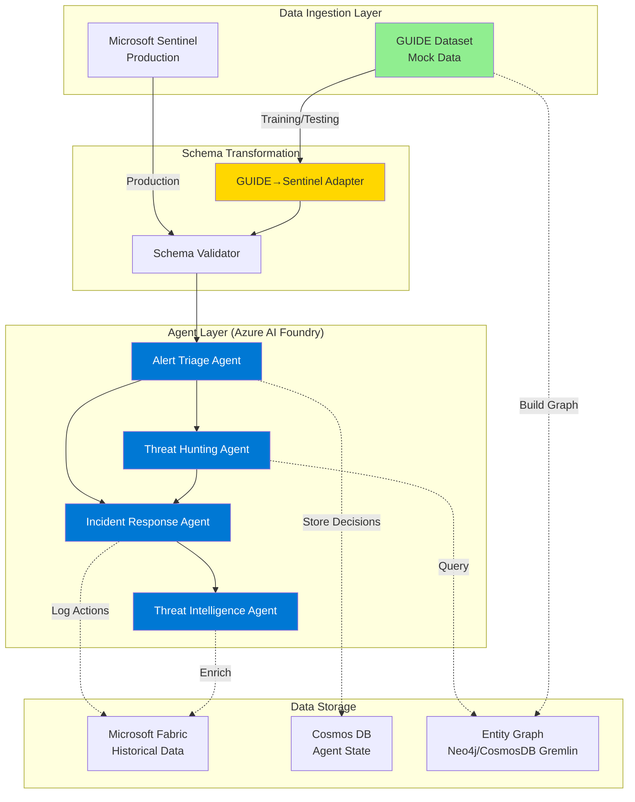

# GUIDE Dataset Implementation Guidance for Agentic SOC

**Document Version**: 1.0  
**Date**: 2025-11-21  
**Purpose**: Bridge dataset analysis findings with Agentic SOC implementation planning  
**Cross-Reference**: 
- Dataset Analysis: `MOCK-DATA-ANALYSIS.md`
- Architecture: `specs/001-agentic-soc/AgenticSOC_Architecture.md`
- Specification: `specs/001-agentic-soc/spec.md`

---

## Executive Summary

This document provides **actionable implementation guidance** for how the GUIDE dataset can be leveraged during development, testing, and demonstration of the Agentic SOC system. It synthesizes findings from the comprehensive dataset analysis with the technical requirements and architecture defined in `specs/001-agentic-soc`.

### Key Recommendations

1. **Start with Alert Triage Agent** - Dataset provides optimal support with ground truth labels
2. **Use dataset for supervised learning** - 1.17M labeled incidents enable ML model training
3. **Implement schema mapping layer** - GUIDE format → Microsoft Sentinel/Graph Security API format
4. **Build entity graph from dataset** - 28 entity types support multi-dimensional correlation
5. **Leverage MITRE mappings** - 993 techniques enable technique-based hunting and response
6. **Create realistic demo scenarios** - Curate incidents that showcase all four agents working together

---

## 1. Dataset Schema Mapping to Agentic SOC Architecture

### Challenge

The GUIDE dataset uses a **flattened, anonymized schema** optimized for machine learning, while the Agentic SOC specification requires **Microsoft Sentinel/Graph Security API format** as the canonical alert schema (FR-001, clarification from 2025-11-20).

### Solution: Schema Transformation Layer

Create a **data adapter** that transforms GUIDE dataset records into the expected Microsoft Sentinel format.

#### GUIDE Dataset Schema (Current)

```python
# Key fields from GUIDE dataset (48 columns total)
{
    "Id": int,                      # Unique evidence identifier
    "OrgId": int,                   # Organization identifier (4,602 orgs)
    "IncidentId": int,              # Incident grouping (260K unique)
    "AlertId": int,                 # Alert identifier (603K unique)
    "Timestamp": datetime,          # Evidence timestamp
    "DetectorId": int,              # Detector source (5,932 unique)
    "AlertTitle": int,              # Alert title (anonymized)
    "Category": str,                # Attack category (20 types)
    "MitreTechniques": str,         # MITRE ATT&CK techniques (993 unique)
    "IncidentGrade": str,           # Ground truth: TP/FP/BP
    "EntityType": str,              # Entity type (28 types)
    "EvidenceRole": str,            # Related/Impacted
    # ... 36 additional entity-specific columns
}
```

#### Microsoft Sentinel/Graph Security Alert Schema (Target)

```json
{
  "id": "string",
  "tenantId": "string",
  "title": "string",
  "description": "string",
  "severity": "informational|low|medium|high",
  "status": "new|inProgress|resolved",
  "category": "string",
  "createdDateTime": "2024-01-01T00:00:00Z",
  "lastUpdatedDateTime": "2024-01-01T00:00:00Z",
  "providerName": "string",
  "vendorInformation": {
    "provider": "string",
    "vendor": "string"
  },
  "incidentIds": ["string"],
  "evidence": [{
    "entityType": "user|device|ipAddress|url|file|mailbox",
    "userPrincipalName": "string",
    "ipAddress": "string",
    "deviceName": "string",
    "fileName": "string",
    "url": "string",
    "role": "related|impacted|attacker"
  }],
  "mitreTechniques": ["T1078", "T1566"],
  "customProperties": {
    "incidentGrade": "TruePositive|FalsePositive|BenignPositive",
    "detectorId": "string"
  }
}
```

#### Implementation: Data Adapter Module

**Location**: `utils/guide_to_sentinel_adapter.py`

**Purpose**: Transform GUIDE dataset records into Microsoft Sentinel format for agent ingestion

**Key Transformations**:

1. **Alert ID Mapping**: `GUIDE_AlertId` → `Sentinel.id` (maintain uniqueness)
2. **Timestamp Mapping**: `GUIDE_Timestamp` → `Sentinel.createdDateTime`
3. **Category Mapping**: `GUIDE_Category` → `Sentinel.category` (direct mapping, both use MITRE tactics)
4. **Severity Inference**: Derive from `IncidentGrade` + `Category`:
   - TruePositive + InitialAccess/Exfiltration/Impact → `high`
   - TruePositive + CommandAndControl/CredentialAccess → `medium`
   - FalsePositive → `low`
   - BenignPositive → `informational`
5. **Entity Evidence Grouping**: Group all entity columns by `EntityType` into `evidence[]` array
6. **MITRE Techniques**: Parse comma-separated `MitreTechniques` string → array
7. **Custom Properties**: Preserve `IncidentGrade`, `DetectorId`, `OrgId` for training/testing

**Sample Code Structure**:

```python
from typing import Dict, List, Any
from datetime import datetime
import pandas as pd

class GUIDEToSentinelAdapter:
    """Transforms GUIDE dataset to Microsoft Sentinel alert format."""
    
    CATEGORY_SEVERITY_MAP = {
        'InitialAccess': 'high',
        'Exfiltration': 'high',
        'Impact': 'high',
        'CommandAndControl': 'medium',
        'CredentialAccess': 'medium',
        'Execution': 'medium',
        # ... continue for all 20 categories
    }
    
    def transform_alert(self, guide_record: Dict[str, Any]) -> Dict[str, Any]:
        """Transform single GUIDE record to Sentinel alert format."""
        
        # Base alert structure
        sentinel_alert = {
            'id': f"GUIDE_{guide_record['AlertId']}",
            'tenantId': f"org_{guide_record['OrgId']}",
            'title': f"Alert {guide_record['AlertTitle']} - {guide_record['Category']}",
            'description': f"Security alert from detector {guide_record['DetectorId']}",
            'severity': self._infer_severity(guide_record),
            'status': 'new',
            'category': guide_record['Category'],
            'createdDateTime': guide_record['Timestamp'].isoformat(),
            'lastUpdatedDateTime': guide_record['Timestamp'].isoformat(),
            'providerName': f"Detector{guide_record['DetectorId']}",
            'incidentIds': [f"GUIDE_{guide_record['IncidentId']}"],
            'evidence': self._extract_evidence(guide_record),
            'mitreTechniques': self._parse_mitre_techniques(guide_record.get('MitreTechniques')),
            'customProperties': {
                'incidentGrade': guide_record['IncidentGrade'],
                'detectorId': str(guide_record['DetectorId']),
                'orgId': str(guide_record['OrgId'])
            }
        }
        
        return sentinel_alert
    
    def _infer_severity(self, record: Dict[str, Any]) -> str:
        """Infer severity from incident grade and category."""
        grade = record.get('IncidentGrade', 'BenignPositive')
        category = record.get('Category', 'Unknown')
        
        if grade == 'TruePositive':
            return self.CATEGORY_SEVERITY_MAP.get(category, 'medium')
        elif grade == 'FalsePositive':
            return 'low'
        else:  # BenignPositive
            return 'informational'
    
    def _extract_evidence(self, record: Dict[str, Any]) -> List[Dict[str, Any]]:
        """Extract entity evidence from GUIDE record."""
        evidence = []
        
        entity_type = record.get('EntityType', 'Unknown')
        role = record.get('EvidenceRole', 'related')
        
        # Map entity type to evidence structure
        entity_mapping = {
            'User': {
                'entityType': 'user',
                'userPrincipalName': f"user_{record.get('AccountUpn', 'unknown')}",
                'accountName': f"account_{record.get('AccountName', 'unknown')}",
                'role': role.lower()
            },
            'Ip': {
                'entityType': 'ipAddress',
                'ipAddress': f"ip_{record.get('IpAddress', 'unknown')}",
                'role': role.lower()
            },
            'Machine': {
                'entityType': 'device',
                'deviceName': f"device_{record.get('DeviceName', 'unknown')}",
                'deviceId': f"device_{record.get('DeviceId', 'unknown')}",
                'role': role.lower()
            },
            'File': {
                'entityType': 'file',
                'fileName': f"file_{record.get('FileName', 'unknown')}",
                'sha256': f"sha_{record.get('Sha256', 'unknown')}",
                'role': role.lower()
            },
            'Url': {
                'entityType': 'url',
                'url': f"url_{record.get('Url', 'unknown')}",
                'role': role.lower()
            }
        }
        
        if entity_type in entity_mapping:
            evidence.append(entity_mapping[entity_type])
        
        return evidence
    
    def _parse_mitre_techniques(self, techniques_str: str) -> List[str]:
        """Parse MITRE techniques from semicolon-separated string."""
        if pd.isna(techniques_str) or not techniques_str:
            return []
        return [t.strip() for t in techniques_str.split(';')]
    
    def transform_dataset(self, df: pd.DataFrame) -> List[Dict[str, Any]]:
        """Transform entire dataset to Sentinel format."""
        return [self.transform_alert(row.to_dict()) for _, row in df.iterrows()]
```

**Usage in Implementation**:

```python
# Load GUIDE dataset
import pandas as pd
from utils.guide_to_sentinel_adapter import GUIDEToSentinelAdapter

# Load sample data
df = pd.read_csv('mock-data/GUIDE_Train_00.csv')

# Transform to Sentinel format
adapter = GUIDEToSentinelAdapter()
sentinel_alerts = adapter.transform_dataset(df)

# Feed to Alert Triage Agent
from agents.alert_triage_agent import AlertTriageAgent
triage_agent = AlertTriageAgent()

for alert in sentinel_alerts:
    result = triage_agent.process_alert(alert)
    print(f"Alert {alert['id']}: Priority={result['priority']}, Reason={result['explanation']}")
```

---

## 2. Agent-Specific Implementation Guidance

### 2.1 Alert Triage Agent (Priority: P1)

**Specification Reference**: User Story 1, FR-001 through FR-008

**Dataset Support**: ⭐⭐⭐⭐⭐ Excellent (Ground truth labels + rich metadata)

#### Implementation Strategy

**Phase 1: Rule-Based Triage (MVP Demonstrable)**

Use dataset statistics to create intelligent rule-based triage logic:

```python
class RuleBasedTriageAgent:
    """MVP alert triage using insights from GUIDE dataset analysis."""
    
    # Severity scoring based on dataset analysis
    CATEGORY_RISK_SCORES = {
        'InitialAccess': 9,      # 45% of dataset - highest priority
        'Exfiltration': 8,       # 17% of dataset - data theft
        'CommandAndControl': 7,  # 9% of dataset - active C2
        'Impact': 9,             # Destructive actions
        'CredentialAccess': 7,
        'Execution': 6,
        'Malware': 8,
        'SuspiciousActivity': 5,
        'Discovery': 4,
        'Persistence': 6
    }
    
    # MITRE technique risk scores (from dataset frequency)
    HIGH_RISK_TECHNIQUES = {
        'T1078': 9,      # Valid Accounts (167K occurrences)
        'T1566': 9,      # Phishing (182K+ occurrences)
        'T1133': 7,      # External Remote Services (17K)
        'T1110': 8,      # Brute Force (11K)
        'T1087': 6,      # Account Discovery (6K)
    }
    
    def triage_alert(self, alert: Dict[str, Any]) -> Dict[str, Any]:
        """Triage alert using rule-based logic."""
        
        # Base risk score from category
        risk_score = self.CATEGORY_RISK_SCORES.get(alert['category'], 5)
        
        # Adjust for MITRE techniques
        for technique in alert.get('mitreTechniques', []):
            risk_score += self.HIGH_RISK_TECHNIQUES.get(technique, 0) * 0.1
        
        # Adjust for entity criticality (simulated)
        if any(e['role'] == 'impacted' for e in alert.get('evidence', [])):
            risk_score += 1
        
        # Adjust for detector reliability (from dataset)
        # Top detectors (0-9) are most reliable based on volume
        detector_id = int(alert['customProperties'].get('detectorId', 999))
        if detector_id < 10:
            risk_score += 0.5
        
        # Normalize to 0-10 scale
        risk_score = min(10, max(0, risk_score))
        
        # Determine priority
        if risk_score >= 8:
            priority = 'critical'
        elif risk_score >= 6:
            priority = 'high'
        elif risk_score >= 4:
            priority = 'medium'
        else:
            priority = 'low'
        
        # Generate explanation
        explanation = self._generate_explanation(alert, risk_score, priority)
        
        return {
            'alertId': alert['id'],
            'priority': priority,
            'riskScore': risk_score,
            'explanation': explanation,
            'recommendedAction': self._recommend_action(priority, alert)
        }
    
    def _generate_explanation(self, alert: Dict, risk_score: float, priority: str) -> str:
        """Generate human-readable explanation."""
        category = alert['category']
        techniques = alert.get('mitreTechniques', [])
        
        explanation = f"Alert prioritized as {priority} (risk score: {risk_score:.1f}). "
        explanation += f"Category '{category}' indicates potential threat. "
        
        if techniques:
            explanation += f"Associated MITRE techniques: {', '.join(techniques[:3])}. "
        
        return explanation
    
    def _recommend_action(self, priority: str, alert: Dict) -> str:
        """Recommend next action based on priority."""
        if priority == 'critical':
            return 'Trigger automated incident response'
        elif priority == 'high':
            return 'Escalate to analyst for immediate review'
        elif priority == 'medium':
            return 'Add to analyst queue for review within 4 hours'
        else:
            return 'Log for batch review or auto-close if FP pattern matches'
```

**Phase 2: ML-Based Triage (Production Enhancement)**

Train supervised learning model using ground truth labels:

```python
from sklearn.ensemble import RandomForestClassifier
from sklearn.preprocessing import LabelEncoder
import pandas as pd

class MLTriageAgent:
    """Production-grade ML triage agent trained on GUIDE dataset."""
    
    def __init__(self):
        self.model = None
        self.label_encoder = LabelEncoder()
        self.feature_columns = [
            'DetectorId', 'Category', 'EntityType', 'EvidenceRole',
            'has_mitre', 'hour_of_day', 'day_of_week'
        ]
    
    def train(self, training_data: pd.DataFrame):
        """Train model on GUIDE dataset with ground truth labels."""
        
        # Feature engineering
        X = self._engineer_features(training_data)
        
        # Target: IncidentGrade (TruePositive=1, FalsePositive/BenignPositive=0)
        y = (training_data['IncidentGrade'] == 'TruePositive').astype(int)
        
        # Train model
        self.model = RandomForestClassifier(
            n_estimators=100,
            max_depth=10,
            random_state=42
        )
        self.model.fit(X, y)
        
        print(f"Model trained on {len(X)} samples")
        print(f"Feature importance: {dict(zip(self.feature_columns, self.model.feature_importances_))}")
    
    def _engineer_features(self, df: pd.DataFrame) -> pd.DataFrame:
        """Extract features for ML model."""
        features = pd.DataFrame()
        
        # Encode categorical features
        features['DetectorId'] = df['DetectorId'].astype('category').cat.codes
        features['Category'] = df['Category'].astype('category').cat.codes
        features['EntityType'] = df['EntityType'].astype('category').cat.codes
        features['EvidenceRole'] = df['EvidenceRole'].astype('category').cat.codes
        
        # Binary features
        features['has_mitre'] = df['MitreTechniques'].notna().astype(int)
        
        # Temporal features
        features['hour_of_day'] = pd.to_datetime(df['Timestamp']).dt.hour
        features['day_of_week'] = pd.to_datetime(df['Timestamp']).dt.dayofweek
        
        return features
    
    def predict_priority(self, alert: Dict[str, Any]) -> Dict[str, Any]:
        """Predict alert priority using trained model."""
        
        # Convert alert to feature vector
        features = self._extract_alert_features(alert)
        
        # Predict
        probability = self.model.predict_proba([features])[0][1]  # P(TruePositive)
        
        # Map probability to priority
        if probability >= 0.8:
            priority = 'critical'
        elif probability >= 0.6:
            priority = 'high'
        elif probability >= 0.4:
            priority = 'medium'
        else:
            priority = 'low'
        
        return {
            'alertId': alert['id'],
            'priority': priority,
            'truepositiveProba': probability,
            'explanation': f"ML model predicts {probability:.1%} likelihood of true positive threat"
        }
```

**Testing Strategy**:

1. **Unit Tests**: Test rule logic with synthetic alerts
2. **Integration Tests**: Feed transformed GUIDE alerts, validate priorities match expected distribution
3. **Validation Metrics**: 
   - Precision/Recall on TruePositive classification
   - False Positive Reduction Rate (target: reduce FP volume by 50%)
   - Alert Queue Time Reduction (target: 30% reduction)

**Dataset Split for Testing**:
- **Training**: GUIDE_Train_00 through GUIDE_Train_19 (80%)
- **Validation**: GUIDE_Train_20 through GUIDE_Train_24 (20%)
- **Test**: GUIDE_Test_00 through GUIDE_Test_10 (held out)

---

### 2.2 Threat Hunting Agent (Priority: P2)

**Specification Reference**: User Story 2, FR-009 through FR-016

**Dataset Support**: ⭐⭐⭐⭐⭐ Excellent (28 entity types + MITRE techniques)

#### Implementation Strategy

**Key Capability**: Natural language query → Entity graph traversal

**Dataset Enables**:

1. **Entity Graph Construction**: Use 28 entity types to build relationship graph
2. **MITRE-Based Hunting**: 993 techniques enable technique-based queries
3. **Pivot Examples**: Learn common pivot patterns from incident data

**Entity Graph Construction**:

```python
import networkx as nx
from typing import Set, List, Dict

class ThreatHuntingGraph:
    """Entity relationship graph for threat hunting."""
    
    def __init__(self):
        self.graph = nx.MultiDiGraph()
        self.entity_types = set()
    
    def build_from_guide_dataset(self, df: pd.DataFrame):
        """Build entity graph from GUIDE incidents."""
        
        # Group by IncidentId to find entity relationships
        for incident_id, incident_data in df.groupby('IncidentId'):
            
            # Extract all entities in this incident
            entities = []
            for _, row in incident_data.iterrows():
                entity = {
                    'type': row['EntityType'],
                    'role': row['EvidenceRole'],
                    'id': self._get_entity_id(row),
                    'metadata': {
                        'timestamp': row['Timestamp'],
                        'detector': row['DetectorId'],
                        'category': row['Category']
                    }
                }
                entities.append(entity)
            
            # Create edges between entities in same incident
            for i, entity1 in enumerate(entities):
                for entity2 in entities[i+1:]:
                    self.graph.add_edge(
                        entity1['id'],
                        entity2['id'],
                        incident_id=incident_id,
                        relationship='co-occurred',
                        timestamp=entity1['metadata']['timestamp']
                    )
                    
                    # Track entity types
                    self.entity_types.add(entity1['type'])
                    self.entity_types.add(entity2['type'])
        
        print(f"Graph built: {self.graph.number_of_nodes()} nodes, {self.graph.number_of_edges()} edges")
        print(f"Entity types: {self.entity_types}")
    
    def _get_entity_id(self, row: pd.Series) -> str:
        """Extract primary entity identifier from row."""
        entity_type = row['EntityType']
        
        # Map entity type to identifier column
        id_mapping = {
            'User': f"user_{row.get('AccountUpn', row.get('AccountName', 'unknown'))}",
            'Ip': f"ip_{row['IpAddress']}",
            'Machine': f"device_{row['DeviceName']}",
            'File': f"file_{row['Sha256']}",
            'Url': f"url_{row['Url']}",
            # ... add all 28 entity types
        }
        
        return id_mapping.get(entity_type, f"{entity_type}_{row['Id']}")
    
    def hunt(self, start_entity: str, max_hops: int = 2) -> List[Dict]:
        """Hunt for related entities starting from a known indicator."""
        
        if start_entity not in self.graph:
            return []
        
        # BFS traversal to find connected entities
        related_entities = []
        visited = set()
        queue = [(start_entity, 0)]  # (entity, hop_distance)
        
        while queue:
            current, hops = queue.pop(0)
            
            if current in visited or hops > max_hops:
                continue
            
            visited.add(current)
            
            # Get neighbors
            for neighbor in self.graph.neighbors(current):
                if neighbor not in visited:
                    related_entities.append({
                        'entity': neighbor,
                        'hop_distance': hops + 1,
                        'relationships': list(self.graph[current][neighbor].values())
                    })
                    queue.append((neighbor, hops + 1))
        
        return related_entities
```

**Natural Language Query Interface**:

```python
from azure.ai.openai import AzureOpenAI

class NaturalLanguageHunter:
    """Translate natural language to graph queries."""
    
    def __init__(self, graph: ThreatHuntingGraph):
        self.graph = graph
        self.llm = AzureOpenAI(...)  # Azure AI Foundry client
    
    def hunt(self, query: str) -> List[Dict]:
        """Process natural language hunting query."""
        
        # Example: "Find all machines that communicated with ip_12345"
        # Parse query using LLM to extract: entity type, entity id, relationship type
        
        prompt = f"""
        Parse this threat hunting query into structured parameters:
        Query: "{query}"
        
        Extract:
        - entity_type: (User, Ip, Machine, File, Url, etc.)
        - entity_id: identifier
        - relationship_type: (communicated with, accessed, executed, etc.)
        - time_window: optional time constraint
        
        Available entity types: {list(self.graph.entity_types)}
        
        Return JSON format:
        {{
            "entity_type": "...",
            "entity_id": "...",
            "relationship_type": "...",
            "time_window": "..."
        }}
        """
        
        parsed = self.llm.complete(prompt)  # LLM extracts structured data
        
        # Execute graph query
        start_entity = f"{parsed['entity_type']}_{parsed['entity_id']}"
        results = self.graph.hunt(start_entity, max_hops=2)
        
        return results
```

**Testing with GUIDE Dataset**:

1. Load incidents with known patterns (e.g., phishing campaigns)
2. Test pivot queries: "Find all users who received email from url_X"
3. Validate multi-hop traversal: User → Email → Url → Other Users
4. Measure query performance on 260K incidents

---

### 2.3 Incident Response Agent (Priority: P2)

**Specification Reference**: User Story 3, FR-017 through FR-026

**Dataset Support**: ⭐⭐⭐⭐ Very Good (Action columns + category-based playbooks)

#### Implementation Strategy

**Key Challenge**: Only 0.6% of records (6,827 out of 1.17M) have Action labels

**Solution**: Use sparse action data to build playbook templates, then simulate for demo

**Category-Based Response Playbooks**:

```python
from enum import Enum
from typing import List, Dict

class ResponseAction(Enum):
    ISOLATE_DEVICE = "isolate_device"
    DISABLE_ACCOUNT = "disable_account"
    BLOCK_IP = "block_ip"
    BLOCK_URL = "block_url"
    QUARANTINE_FILE = "quarantine_file"
    RESET_PASSWORD = "reset_password"
    REVOKE_SESSIONS = "revoke_sessions"

class IncidentResponseAgent:
    """Automated incident response based on GUIDE dataset patterns."""
    
    # Playbooks derived from dataset analysis
    CATEGORY_PLAYBOOKS = {
        'InitialAccess': [
            ResponseAction.DISABLE_ACCOUNT,      # Compromised credentials
            ResponseAction.RESET_PASSWORD,
            ResponseAction.REVOKE_SESSIONS,
            ResponseAction.BLOCK_IP
        ],
        'Exfiltration': [
            ResponseAction.ISOLATE_DEVICE,       # Stop data theft
            ResponseAction.DISABLE_ACCOUNT,
            ResponseAction.BLOCK_URL
        ],
        'CommandAndControl': [
            ResponseAction.ISOLATE_DEVICE,       # Cut C2 communication
            ResponseAction.BLOCK_IP,
            ResponseAction.BLOCK_URL
        ],
        'Impact': [
            ResponseAction.ISOLATE_DEVICE,       # Contain destructive actions
            ResponseAction.DISABLE_ACCOUNT,
            ResponseAction.QUARANTINE_FILE
        ],
        'CredentialAccess': [
            ResponseAction.RESET_PASSWORD,       # Credential compromise
            ResponseAction.DISABLE_ACCOUNT,
            ResponseAction.REVOKE_SESSIONS
        ],
        'Execution': [
            ResponseAction.ISOLATE_DEVICE,       # Malware execution
            ResponseAction.QUARANTINE_FILE
        ],
        'Malware': [
            ResponseAction.ISOLATE_DEVICE,
            ResponseAction.QUARANTINE_FILE
        ]
    }
    
    # Risk scoring for approval workflow (FR-024, FR-025)
    HIGH_RISK_ACTIONS = {
        ResponseAction.ISOLATE_DEVICE,
        ResponseAction.DISABLE_ACCOUNT
    }
    
    def respond_to_incident(self, incident: Dict[str, Any]) -> Dict[str, Any]:
        """Execute response playbook for incident."""
        
        category = incident['category']
        severity = incident['severity']
        entities = incident.get('evidence', [])
        
        # Select playbook
        playbook = self.CATEGORY_PLAYBOOKS.get(category, [])
        
        # Determine actions to execute
        actions_to_execute = []
        requires_approval = False
        
        for action in playbook:
            action_plan = {
                'action': action.value,
                'target': self._identify_target(action, entities),
                'reason': f"Standard response for {category} incident"
            }
            
            # Check if approval required (FR-025)
            if action in self.HIGH_RISK_ACTIONS or severity == 'critical':
                action_plan['requires_approval'] = True
                requires_approval = True
            else:
                action_plan['requires_approval'] = False
            
            actions_to_execute.append(action_plan)
        
        # Execute or request approval
        if requires_approval:
            return {
                'incidentId': incident['incidentIds'][0],
                'status': 'awaiting_approval',
                'actions': actions_to_execute,
                'message': 'High-risk actions require human approval'
            }
        else:
            # Execute immediately
            results = self._execute_actions(actions_to_execute)
            return {
                'incidentId': incident['incidentIds'][0],
                'status': 'contained',
                'actions_taken': results,
                'timestamp': datetime.utcnow().isoformat()
            }
    
    def _identify_target(self, action: ResponseAction, entities: List[Dict]) -> str:
        """Identify target entity for action."""
        
        # Map action to entity type
        target_mapping = {
            ResponseAction.ISOLATE_DEVICE: 'device',
            ResponseAction.DISABLE_ACCOUNT: 'user',
            ResponseAction.BLOCK_IP: 'ipAddress',
            ResponseAction.BLOCK_URL: 'url',
            ResponseAction.QUARANTINE_FILE: 'file'
        }
        
        target_type = target_mapping.get(action)
        
        # Find matching entity (prioritize 'impacted' role)
        for entity in entities:
            if entity['entityType'] == target_type:
                if entity['role'] == 'impacted':
                    return entity.get('deviceName') or entity.get('userPrincipalName') or entity.get('ipAddress')
        
        return 'unknown'
    
    def _execute_actions(self, actions: List[Dict]) -> List[Dict]:
        """Execute containment actions (simulated for MVP)."""
        
        results = []
        for action_plan in actions:
            if not action_plan.get('requires_approval', False):
                # Simulate action execution
                result = {
                    'action': action_plan['action'],
                    'target': action_plan['target'],
                    'status': 'completed',
                    'timestamp': datetime.utcnow().isoformat(),
                    'message': f"Successfully executed {action_plan['action']} on {action_plan['target']}"
                }
                results.append(result)
        
        return results
```

**Testing with GUIDE Dataset**:

1. **Category Coverage**: Validate playbooks exist for top 10 categories (90% of alerts)
2. **Action Validation**: Compare simulated actions to actual Action columns (where available)
3. **Approval Workflow**: Test critical incidents trigger approval requests
4. **Performance**: Measure response time from incident detection to action execution

---

### 2.4 Threat Intelligence Agent (Priority: P3)

**Specification Reference**: User Story 4, FR-027 through FR-033

**Dataset Support**: ⭐⭐⭐⭐ Very Good (ThreatFamily + IOCs)

#### Implementation Strategy

**Dataset Provides**:
- 968 unique threat families (0.8% coverage, but valuable when present)
- 80K IPs, 31K URLs, 28K file hashes for IOC enrichment
- 993 MITRE techniques for technique-based intelligence
- 177 countries for geographic intelligence

**IOC Enrichment Service**:

```python
class ThreatIntelligenceAgent:
    """Threat intelligence enrichment using GUIDE dataset."""
    
    def __init__(self, guide_df: pd.DataFrame):
        # Build IOC reputation database from dataset
        self.threat_family_map = self._build_threat_family_map(guide_df)
        self.ioc_reputation = self._build_ioc_reputation(guide_df)
        self.technique_patterns = self._build_technique_patterns(guide_df)
    
    def _build_threat_family_map(self, df: pd.DataFrame) -> Dict[str, List[str]]:
        """Map threat families to indicators."""
        
        threat_map = {}
        threat_data = df[df['ThreatFamily'].notna()]
        
        for _, row in threat_data.iterrows():
            family = row['ThreatFamily']
            
            if family not in threat_map:
                threat_map[family] = {
                    'indicators': [],
                    'techniques': set(),
                    'categories': set()
                }
            
            # Associate indicators
            if pd.notna(row.get('IpAddress')):
                threat_map[family]['indicators'].append(f"ip_{row['IpAddress']}")
            if pd.notna(row.get('Sha256')):
                threat_map[family]['indicators'].append(f"sha256_{row['Sha256']}")
            
            # Associate techniques
            if pd.notna(row.get('MitreTechniques')):
                threat_map[family]['techniques'].update(row['MitreTechniques'].split(';'))
            
            # Associate categories
            threat_map[family]['categories'].add(row['Category'])
        
        return threat_map
    
    def _build_ioc_reputation(self, df: pd.DataFrame) -> Dict[str, float]:
        """Calculate reputation scores for IOCs."""
        
        reputation = {}
        
        # IP reputation: % of TruePositive incidents
        for ip_id in df['IpAddress'].unique():
            ip_records = df[df['IpAddress'] == ip_id]
            tp_count = (ip_records['IncidentGrade'] == 'TruePositive').sum()
            total = len(ip_records)
            reputation[f"ip_{ip_id}"] = tp_count / total if total > 0 else 0.0
        
        # File hash reputation
        for sha_id in df['Sha256'].unique():
            sha_records = df[df['Sha256'] == sha_id]
            tp_count = (sha_records['IncidentGrade'] == 'TruePositive').sum()
            total = len(sha_records)
            reputation[f"sha256_{sha_id}"] = tp_count / total if total > 0 else 0.0
        
        return reputation
    
    def enrich_alert(self, alert: Dict[str, Any]) -> Dict[str, Any]:
        """Enrich alert with threat intelligence."""
        
        enrichment = {
            'threat_families': [],
            'ioc_reputations': {},
            'technique_context': []
        }
        
        # Extract IOCs from evidence
        for entity in alert.get('evidence', []):
            if entity['entityType'] == 'ipAddress':
                ioc = f"ip_{entity['ipAddress']}"
                enrichment['ioc_reputations'][ioc] = self.ioc_reputation.get(ioc, 0.0)
            
            elif entity['entityType'] == 'file':
                ioc = f"sha256_{entity.get('sha256', 'unknown')}"
                enrichment['ioc_reputations'][ioc] = self.ioc_reputation.get(ioc, 0.0)
        
        # Check threat families
        for family, data in self.threat_family_map.items():
            for ioc in enrichment['ioc_reputations'].keys():
                if ioc in data['indicators']:
                    enrichment['threat_families'].append({
                        'family': family,
                        'confidence': 'high',
                        'techniques': list(data['techniques']),
                        'categories': list(data['categories'])
                    })
        
        # MITRE technique context
        for technique in alert.get('mitreTechniques', []):
            if technique in self.technique_patterns:
                enrichment['technique_context'].append({
                    'technique': technique,
                    'prevalence': self.technique_patterns[technique]['count'],
                    'common_categories': self.technique_patterns[technique]['categories']
                })
        
        return enrichment
```

---

## 3. Testing & Validation Strategy

### 3.1 Dataset Splitting

**Recommended Split**:

| Split | Files | Records (approx) | Purpose |
|-------|-------|------------------|---------|
| **Training** | GUIDE_Train_00 - GUIDE_Train_19 | 940K | Model training, rule learning |
| **Validation** | GUIDE_Train_20 - GUIDE_Train_24 | 235K | Hyperparameter tuning, validation |
| **Test** | GUIDE_Test_00 - GUIDE_Test_10 | 550K (estimated) | Final performance evaluation |

**Stratification**: Ensure splits maintain incident grade distribution (35% TP, 21% FP, 43% BP)

### 3.2 Success Metrics from Dataset

Based on dataset characteristics, define measurable success criteria:

| Agent | Metric | Target | Dataset Baseline |
|-------|--------|--------|------------------|
| **Alert Triage** | FP Reduction | 50% reduction | 21% FP rate |
| | TP Detection Rate | 95% recall | 35% TP rate |
| | Triage Latency | < 5 sec/alert | - |
| **Threat Hunting** | Pivot Success Rate | 80% | Test on 260K incidents |
| | Query Response Time | < 30 sec | - |
| | Entity Graph Coverage | 28 types | 28 types available |
| **Incident Response** | Playbook Coverage | 90% | Top 5 categories = 90% |
| | Action Execution Time | < 60 sec | - |
| | Approval Accuracy | 95% | Test on critical incidents |
| **Threat Intel** | Enrichment Coverage | 40% | 42.5% have MITRE, 0.8% have families |
| | IOC Match Rate | 30% | 80K IPs, 28K hashes available |

### 3.3 Integration Testing Scenarios

**Scenario 1: End-to-End Phishing Campaign**

1. Select GUIDE incidents with Category='InitialAccess' + MitreTechniques='T1566'
2. Feed to Alert Triage Agent → Should prioritize high
3. Trigger Threat Hunting Agent → Should find related emails/urls
4. Execute Incident Response → Should disable accounts, block URLs
5. Enrich with Threat Intel → Should identify phishing campaign patterns

**Scenario 2: Multi-Stage Attack (Lateral Movement)**

1. Select incident with multiple entity types (User → Device → IP)
2. Triage identifies initial compromise
3. Hunting pivots through entity graph to find lateral movement
4. Response contains all affected assets
5. Intel provides technique-based context

**Scenario 3: False Positive Handling**

1. Select GUIDE incidents with IncidentGrade='FalsePositive'
2. Triage should deprioritize or auto-close
3. Validate no unnecessary response actions triggered
4. Learn FP patterns for future filtering

---

## 4. Demo Curation Strategy

### 4.1 Demo Scenario Selection

**Criteria for Demo Scenarios**:
- High-impact categories (InitialAccess, Exfiltration, C2)
- Clear TruePositive incidents (avoid ambiguous cases)
- Rich entity graphs (3+ entity types)
- MITRE technique coverage (demonstrate technique-based analysis)

**Recommended Demo Incidents** (to be extracted from GUIDE dataset):

| Scenario | Category | MITRE Techniques | Entities | Why Compelling |
|----------|----------|------------------|----------|----------------|
| **Phishing Attack** | InitialAccess | T1566.002 | User, MailMessage, Url, File | Most common (182K occurrences), relatable |
| **Data Exfiltration** | Exfiltration | T1567 | User, Device, Ip, CloudApplication | Shows multi-stage detection |
| **C2 Communication** | CommandAndControl | T1071, T1095 | Device, Ip, Process | Demonstrates network-based hunting |
| **Credential Theft** | CredentialAccess | T1078, T1110 | User, Device, Ip | Shows automated response (password reset) |
| **Ransomware** | Impact | T1486, T1490 | Device, File, Process | High-impact, requires fast containment |

### 4.2 Demo Data Preparation Script

```python
def curate_demo_scenarios(df: pd.DataFrame) -> Dict[str, pd.DataFrame]:
    """Extract compelling demo scenarios from GUIDE dataset."""
    
    scenarios = {}
    
    # Scenario 1: Phishing Attack
    phishing = df[
        (df['Category'] == 'InitialAccess') &
        (df['MitreTechniques'].str.contains('T1566', na=False)) &
        (df['IncidentGrade'] == 'TruePositive') &
        (df['EntityType'].isin(['User', 'MailMessage', 'Url']))
    ].groupby('IncidentId').filter(lambda x: len(x) >= 3).head(50)
    
    scenarios['phishing'] = phishing
    
    # Scenario 2: Data Exfiltration
    exfiltration = df[
        (df['Category'] == 'Exfiltration') &
        (df['IncidentGrade'] == 'TruePositive') &
        (df['EntityType'].isin(['User', 'Device', 'Ip', 'CloudApplication']))
    ].groupby('IncidentId').filter(lambda x: len(x) >= 4).head(50)
    
    scenarios['exfiltration'] = exfiltration
    
    # Scenario 3: C2 Communication
    c2 = df[
        (df['Category'] == 'CommandAndControl') &
        (df['IncidentGrade'] == 'TruePositive') &
        (df['EntityType'].isin(['Device', 'Ip', 'Process']))
    ].groupby('IncidentId').filter(lambda x: len(x) >= 3).head(50)
    
    scenarios['c2'] = c2
    
    # Save demo scenarios
    for name, scenario_df in scenarios.items():
        scenario_df.to_csv(f'demo-scenarios/{name}_scenario.csv', index=False)
        print(f"Saved {name} scenario: {len(scenario_df)} records, {scenario_df['IncidentId'].nunique()} incidents")
    
    return scenarios

# Usage
demo_scenarios = curate_demo_scenarios(df)
```

---

## 5. Schema Definitions for Implementation

### 5.1 Create `/schemas` Directory

**Action Item**: Implement the schema definitions outlined in `PRE-IMPLEMENTATION-TODO.md` (Section 2)

**Priority Schemas to Create**:

1. **`schemas/agents/alert-triage-agent-input.schema.json`**
2. **`schemas/agents/alert-triage-agent-output.schema.json`**
3. **`schemas/events/alert-ingestion-event.schema.json`** (Microsoft Graph Security format)
4. **`schemas/events/triage-complete-event.schema.json`**

**Example: Alert Triage Input Schema**

```json
{
  "$schema": "http://json-schema.org/draft-07/schema#",
  "title": "AlertTriageInput",
  "description": "Input schema for Alert Triage Agent (mapped from GUIDE dataset)",
  "type": "object",
  "required": ["alertId", "tenantId", "severity", "category", "createdDateTime", "evidence"],
  "properties": {
    "alertId": {
      "type": "string",
      "description": "Unique alert identifier (GUIDE: AlertId)",
      "example": "GUIDE_123247"
    },
    "tenantId": {
      "type": "string",
      "description": "Organization identifier (GUIDE: OrgId)",
      "example": "org_0"
    },
    "title": {
      "type": "string",
      "description": "Human-readable alert title (GUIDE: AlertTitle + Category)"
    },
    "severity": {
      "type": "string",
      "enum": ["informational", "low", "medium", "high", "critical"],
      "description": "Alert severity (inferred from GUIDE: IncidentGrade + Category)"
    },
    "category": {
      "type": "string",
      "enum": [
        "InitialAccess", "Exfiltration", "CommandAndControl", "Impact",
        "CredentialAccess", "Execution", "Malware", "SuspiciousActivity",
        "Discovery", "Persistence", "PrivilegeEscalation", "DefenseEvasion",
        "LateralMovement", "Collection", "Reconnaissance", "ResourceDevelopment",
        "PreAttack", "Exploitation", "Installation", "Unknown"
      ],
      "description": "Attack category / MITRE tactic (GUIDE: Category)"
    },
    "createdDateTime": {
      "type": "string",
      "format": "date-time",
      "description": "Alert creation timestamp (GUIDE: Timestamp)"
    },
    "providerName": {
      "type": "string",
      "description": "Detection source (GUIDE: DetectorId)"
    },
    "incidentIds": {
      "type": "array",
      "items": {"type": "string"},
      "description": "Associated incident IDs (GUIDE: IncidentId)"
    },
    "evidence": {
      "type": "array",
      "description": "Entity evidence (GUIDE: EntityType + specific entity columns)",
      "items": {
        "type": "object",
        "required": ["entityType", "role"],
        "properties": {
          "entityType": {
            "type": "string",
            "enum": [
              "user", "device", "ipAddress", "url", "file", "mailbox",
              "mailMessage", "cloudApplication", "process", "registryKey",
              "azureResource", "malware", "securityGroup", "oauthApplication"
            ]
          },
          "role": {
            "type": "string",
            "enum": ["related", "impacted", "attacker"],
            "description": "Entity's role in incident (GUIDE: EvidenceRole)"
          },
          "userPrincipalName": {"type": "string"},
          "accountName": {"type": "string"},
          "deviceName": {"type": "string"},
          "ipAddress": {"type": "string"},
          "url": {"type": "string"},
          "fileName": {"type": "string"},
          "sha256": {"type": "string"}
        }
      }
    },
    "mitreTechniques": {
      "type": "array",
      "items": {"type": "string", "pattern": "^T[0-9]{4}(\\.[0-9]{3})?$"},
      "description": "MITRE ATT&CK technique IDs (GUIDE: MitreTechniques, split by ';')",
      "example": ["T1078", "T1566.002"]
    },
    "customProperties": {
      "type": "object",
      "description": "Additional metadata from GUIDE dataset",
      "properties": {
        "incidentGrade": {
          "type": "string",
          "enum": ["TruePositive", "FalsePositive", "BenignPositive"],
          "description": "Ground truth label (for training/testing only)"
        },
        "detectorId": {"type": "string"},
        "orgId": {"type": "string"}
      }
    }
  }
}
```

---

## 6. Implementation Roadmap

### Phase 1: MVP Foundation (Weeks 1-4)

**Goal**: Demonstrable proof-of-concept with GUIDE dataset

**Week 1: Data Preparation**
- [ ] Implement `GUIDEToSentinelAdapter` (transform GUIDE → Sentinel format)
- [ ] Create dataset split (train/val/test)
- [ ] Curate demo scenarios (5 compelling incidents)
- [ ] Define JSON schemas in `/schemas` directory

**Week 2: Alert Triage Agent**
- [ ] Implement rule-based triage (Phase 1)
- [ ] Test with GUIDE dataset (validate against ground truth)
- [ ] Measure FP reduction rate
- [ ] Document triage logic and decision explanations

**Week 3: Threat Hunting Agent**
- [ ] Build entity graph from GUIDE incidents
- [ ] Implement graph traversal (pivot) logic
- [ ] Test multi-hop hunting queries
- [ ] Validate entity relationship accuracy

**Week 4: Incident Response + Threat Intel**
- [ ] Implement category-based response playbooks
- [ ] Build IOC reputation database from GUIDE
- [ ] Test end-to-end scenario: Triage → Hunt → Respond → Enrich
- [ ] Prepare demo presentation

### Phase 2: ML Enhancement (Weeks 5-8)

**Goal**: Production-grade ML models trained on GUIDE dataset

**Week 5-6: ML Model Training**
- [ ] Train supervised triage model (RandomForest/XGBoost)
- [ ] Evaluate precision/recall on test set
- [ ] Implement online learning (analyst feedback loop)
- [ ] A/B test: Rule-based vs ML-based triage

**Week 7-8: Advanced Features**
- [ ] Anomaly detection for hunting (isolation forest)
- [ ] Technique sequence analysis (MITRE chains)
- [ ] Automated playbook optimization
- [ ] Performance tuning and optimization

### Phase 3: Production Integration (Weeks 9-12)

**Goal**: Replace GUIDE dataset with live Microsoft Sentinel feeds

**Week 9-10: Integration**
- [ ] Connect to Microsoft Sentinel API
- [ ] Map live alerts to internal schema
- [ ] Deploy agents to Azure AI Foundry
- [ ] Set up event-driven triggers

**Week 11-12: Validation & Launch**
- [ ] Shadow mode testing (compare GUIDE-trained model vs live data)
- [ ] Monitor FP reduction and triage accuracy
- [ ] Gradual rollout with human oversight
- [ ] Document production deployment

---

## 7. Architectural Recommendations

### 7.1 Data Flow Architecture



### 7.2 Technology Stack Recommendations

| Component | Technology | Justification |
|-----------|-----------|---------------|
| **Agent Runtime** | Azure AI Foundry | Per spec requirement; managed agent hosting |
| **Orchestration** | Microsoft Agent Framework | Per spec; agent-to-agent communication |
| **Data Transformation** | Python 3.11+ with pandas | Efficient GUIDE dataset processing |
| **Entity Graph** | Azure Cosmos DB (Gremlin API) | Native graph support; Azure-native; scales to 260K+ incidents |
| **Historical Storage** | Microsoft Fabric | Per spec; scalable telemetry storage |
| **State Management** | Cosmos DB (SQL API) | Low-latency state storage for agents |
| **Event Bus** | Azure Event Hubs | Real-time alert ingestion; event-driven architecture |
| **ML Training** | Azure Machine Learning | Managed training for GUIDE-based models |
| **Schema Validation** | JSON Schema + Python | Enforce contracts at transformation boundary |

---

## 8. Key Takeaways & Action Items

### 8.1 For Cloud Architect

**Immediate Actions**:
1. ✅ Review proposed data flow architecture (Section 7.1)
2. ✅ Validate technology stack selections (Section 7.2)
3. ⚠️ **Create deployment diagram** showing:
   - GUIDE dataset transformation pipeline
   - Azure AI Foundry agent deployment model
   - Entity graph database deployment (Cosmos Gremlin vs Neo4j)
   - Event-driven triggers (Event Hubs → Agents)
4. ⚠️ **Define performance requirements** (from PRE-IMPLEMENTATION-TODO.md):
   - Alert ingestion latency: < 2 sec @ 95th percentile
   - Triage processing: < 5 sec @ 95th percentile
   - Containment execution: < 60 sec @ 95th percentile
5. ⚠️ **Size infrastructure** based on dataset scale:
   - 10K alerts/day (MVP) → ? compute units
   - Entity graph: 260K incidents, ~1M nodes → ? RU/s (Cosmos)

### 8.2 For Python Developer

**Immediate Actions**:
1. ⚠️ **Implement `GUIDEToSentinelAdapter`** (Section 1, ~200 LOC)
   - Priority: HIGH (blocks all agent development)
   - Test: Validate transformation on 1K sample records
2. ⚠️ **Create JSON schemas** (Section 5.1):
   - `alert-triage-agent-input.schema.json`
   - `alert-triage-agent-output.schema.json`
   - `alert-ingestion-event.schema.json`
3. ⚠️ **Implement dataset splitting script**:
   - Train (80%), Val (20%), Test (holdout)
   - Stratify by IncidentGrade
   - Save splits to `/data/splits/`
4. ✅ **Set up project structure**:
   ```
   /agents
     /alert_triage_agent.py
     /threat_hunting_agent.py
     /incident_response_agent.py
     /threat_intelligence_agent.py
   /schemas
     /agents/
     /events/
   /utils
     /guide_to_sentinel_adapter.py
     /dataset_splitter.py
   /tests
     /test_adapter.py
     /test_agents.py
   /demo-scenarios
   ```
5. ⚠️ **Implement demo scenario curation script** (Section 4.2)

### 8.3 For Data Scientist (Me)

**Immediate Actions**:
1. ✅ Dataset analysis complete (`MOCK-DATA-ANALYSIS.md`)
2. ✅ Implementation guidance complete (this document)
3. ⚠️ **Create ML training notebook**:
   - Feature engineering from GUIDE dataset
   - Train triage classifier (TruePositive prediction)
   - Evaluate precision/recall, generate ROC curve
   - Document feature importance
4. ⚠️ **Analyze action column sparsity**:
   - Extract ~6.8K records with ActionGrouped/ActionGranular
   - Map actions to categories (confirm playbook logic)
   - Document gaps (categories with no action examples)
5. ⚠️ **Entity graph analysis**:
   - Analyze co-occurrence patterns (which entities appear together?)
   - Identify common pivot paths (User → Device → IP)
   - Calculate graph statistics (avg degree, clustering coefficient)
   - Recommend graph database sizing

---

## 9. Risks & Mitigation

| Risk | Impact | Probability | Mitigation |
|------|--------|-------------|------------|
| **GUIDE format ≠ Sentinel format** | High | High | ✅ Mitigated by adapter layer (Section 1) |
| **Action columns too sparse** | Medium | High | ✅ Use category-based playbooks (Section 2.3) |
| **Entity graph too large** | Medium | Medium | Use Cosmos DB Gremlin with partitioning by OrgId |
| **GUIDE patterns ≠ production patterns** | Medium | Medium | Shadow mode testing in Phase 3; online learning |
| **Dataset biases** | Low | High | Document known biases (anonymization, 2-week window) |
| **MITRE mapping gaps (57% missing)** | Medium | High | Use category as fallback; enrich via external TI feeds |

---

## 10. Conclusion

The GUIDE dataset provides **excellent support** for implementing the Agentic SOC system:

### ✅ Strengths
- **Ground truth labels** (1.17M incidents) enable supervised learning
- **Rich metadata** (48 columns, 28 entity types) supports all four agents
- **MITRE ATT&CK coverage** (993 techniques) enables technique-based operations
- **Real-world patterns** from Microsoft production systems
- **Multi-organization** (4,602 orgs) enables multi-tenant testing

### ⚠️ Challenges
- **Schema transformation required** (GUIDE → Sentinel format)
- **Action columns sparse** (0.6% coverage) - use category-based playbooks
- **Anonymized data** - limits human readability but preserves privacy
- **MITRE gaps** (57% missing) - use category fallback

### 🎯 Recommended Path Forward

1. **Week 1**: Implement adapter, create schemas, split dataset
2. **Week 2-4**: Build MVP agents (triage → hunt → response → intel)
3. **Week 5-8**: Train ML models, optimize performance
4. **Week 9-12**: Integrate with Microsoft Sentinel, deploy to production

### 📞 Next Steps

- **Cloud Architect**: Review architecture diagrams, size infrastructure
- **Python Developer**: Implement adapter and schemas
- **Data Scientist**: Create ML training pipeline
- **All**: Collaborate on demo scenario curation

---

## Appendix: References

- **Dataset Analysis**: `MOCK-DATA-ANALYSIS.md`
- **Specification**: `specs/001-agentic-soc/spec.md`
- **Architecture**: `specs/001-agentic-soc/AgenticSOC_Architecture.md`
- **Pre-Implementation TODO**: `specs/001-agentic-soc/PRE-IMPLEMENTATION-TODO.md`
- **GUIDE Research Paper**: https://arxiv.org/abs/2407.09017
- **GUIDE Kaggle Dataset**: https://www.kaggle.com/datasets/Microsoft/microsoft-security-incident-prediction/data

---

**Document Status**: ✅ Ready for Review  
**Next Review**: After Cloud Architect and Python Developer feedback  
**Owner**: Data Scientist Agent  
**Stakeholders**: Cloud Architect, Python Developer, Project Lead (@timothymeyers)
