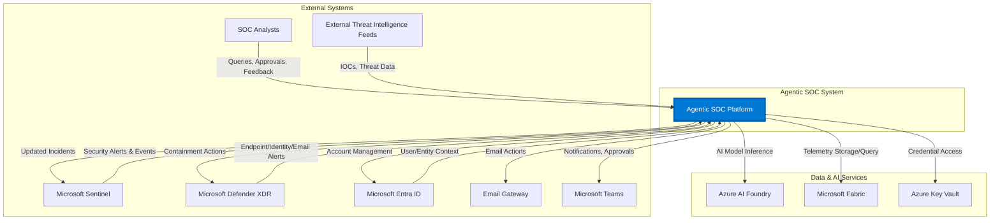
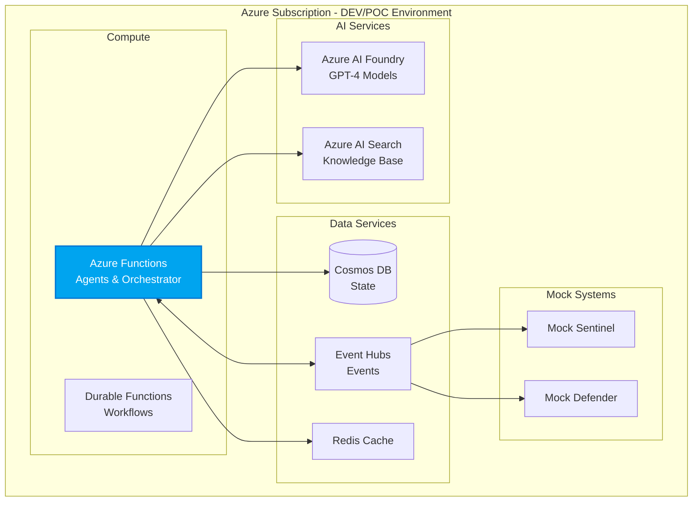
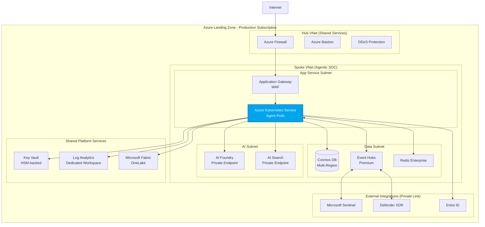
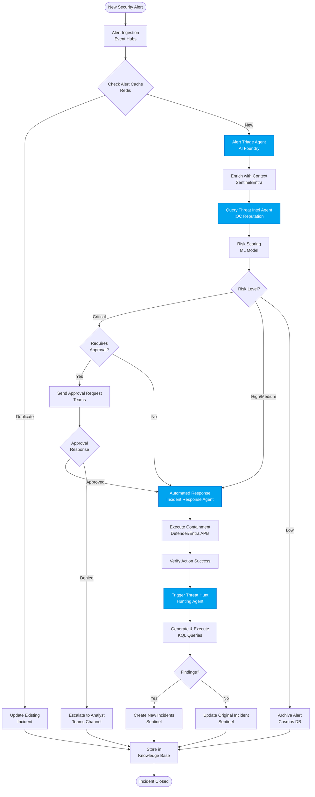
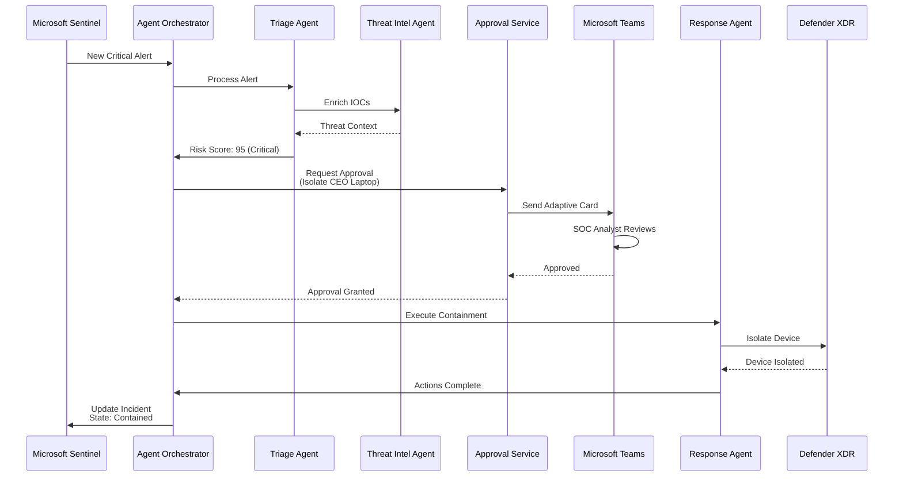
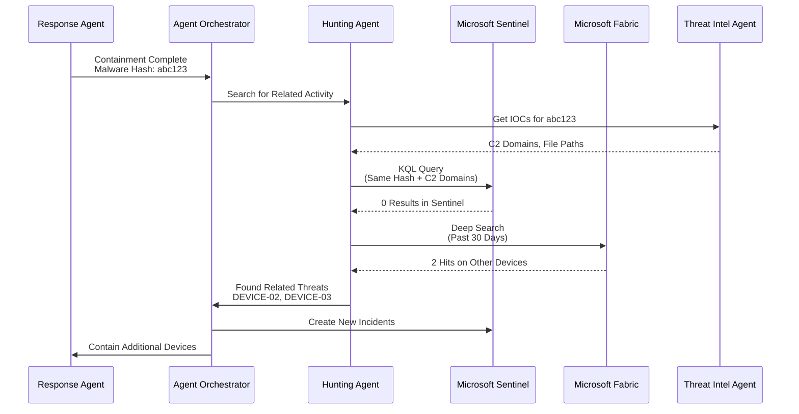
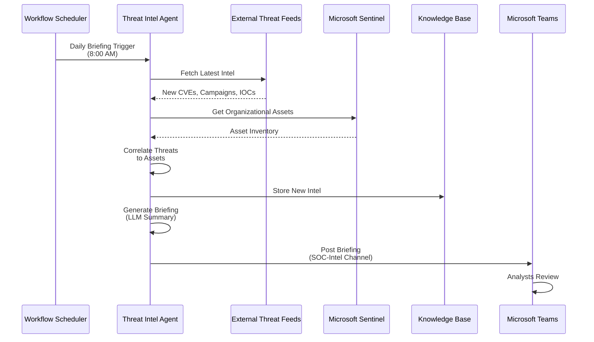

# Agentic Security Operations Center (SOC) - Architecture Assessment

**Document Version**: 1.0  
**Date**: 2025-11-20  
**Architect**: Principal Cloud Architect  
**Spec Reference**: `specs/001-agentic-soc/spec.md`

---

## Executive Summary

This document provides a comprehensive architectural assessment and design for the **Agentic Security Operations Center (SOC)** system. The Agentic SOC represents a transformative approach to security operations, leveraging AI-powered agents built on Azure AI Foundry to augment human security analysts with intelligent, autonomous capabilities for alert triage, threat hunting, incident response, and threat intelligence.

### Assessment Overview

**Specification Quality**: Excellent (95/100)
- Well-defined functional requirements (52 FRs)
- Clear user stories with acceptance criteria  
- Comprehensive success criteria (30 measurable outcomes)
- All critical architectural questions addressed through clarification process

**Architecture Complexity**: High
- Multi-agent orchestration with shared context
- Real-time event processing at scale
- Integration with multiple Microsoft Security services
- Autonomous operations with human oversight controls

**Recommended Approach**: Phased Implementation
- **Phase 1 (MVP)**: Core agent capabilities with simulated data, demonstrable proof of concept
- **Phase 2 (Production)**: Full production integration, advanced features, enterprise scale

### Key Architectural Decisions

1. **AI Platform**: Azure AI Foundry with AI Foundry Client for all agent implementations
2. **Orchestration**: Microsoft Agent Framework for agent-to-agent coordination
3. **Authentication**: Azure Managed Identity with Entra ID RBAC (primary), Service Principal with Key Vault (fallback)
4. **Data Platform**: Microsoft Sentinel as central security data hub, Microsoft Fabric for scalable telemetry storage
5. **Alert Schema**: Microsoft Sentinel/Graph Security API format as canonical schema
6. **Incident States**: New → Investigating → Contained → Resolved → Closed
7. **Approval Model**: Risk-scored threshold requiring human approval for critical assets and irreversible operations

### Architecture Highlights

- **Four Specialized AI Agents**: Alert Triage, Threat Hunting, Incident Response, Threat Intelligence
- **Event-Driven Architecture**: Real-time processing with sub-second response for critical events
- **Zero Trust Security**: Managed identities, RBAC, encrypted communication, audit logging
- **Scalability**: Designed to handle 10,000+ alerts per day with horizontal scaling
- **Explainability**: Every AI decision includes natural language rationale
- **Constitutional Governance**: Aligned with seven core principles for safe, effective AI operations

---

## System Context Diagram



### System Context Explanation

#### Overview
The Agentic SOC platform sits at the center of the organization's security ecosystem, acting as an intelligent orchestration layer between security data sources, AI services, and action endpoints. It operates autonomously within defined boundaries while maintaining human oversight for critical decisions.

#### Key Components and Relationships

**Input Sources:**
- **Microsoft Sentinel**: Primary SIEM providing aggregated security alerts, incidents, and historical telemetry
- **Microsoft Defender XDR**: Real-time endpoint, identity, email, and cloud app security events
- **Microsoft Entra ID**: User accounts, group memberships, sign-in logs, risk scores for contextual enrichment
- **External Threat Intelligence Feeds**: Industry threat intelligence, IOCs, vulnerability advisories, threat actor profiles
- **SOC Analysts**: Natural language queries, approval decisions, feedback on AI decisions, manual investigations

**Output Targets:**
- **Microsoft Defender XDR**: Containment actions (endpoint isolation, process termination, file quarantine)
- **Microsoft Entra ID**: Account management (disable accounts, reset passwords, revoke sessions)
- **Microsoft Sentinel**: Incident updates, new alerts from hunting, enrichment metadata
- **Microsoft Teams**: Real-time notifications, approval requests, daily briefings, incident summaries
- **Email Gateway**: Phishing email purge, mailbox rule management, user notifications

**Supporting Services:**
- **Azure AI Foundry**: LLM inference, natural language understanding, decision rationale generation
- **Microsoft Fabric**: Scalable data lake for security telemetry, audit logs, historical analysis
- **Azure Key Vault**: Secure storage for credentials, API keys, certificates for service integration

#### Design Decisions

1. **Microsoft Sentinel as Central Hub**: Chosen as the primary integration point because it already aggregates alerts from multiple sources, provides a unified incident model, and offers rich query capabilities. This reduces integration complexity and leverages existing SIEM infrastructure.

2. **Bidirectional Communication**: The system both consumes data and takes actions. This closed-loop approach enables automated response while maintaining context in the source systems (incidents updated in Sentinel with agent findings).

3. **Human-in-the-Loop via Teams**: Microsoft Teams integration provides familiar, low-friction approval workflows. Analysts can approve high-risk actions directly from Teams notifications without context switching.

4. **External Threat Intelligence**: Broad integration with external feeds ensures the system has current threat context. The architecture supports multiple feed types (commercial, open-source, ISACs) with normalization to STIX/TAXII or custom formats.

#### NFR Considerations

**Scalability**: 
- Sentinel and Fabric provide virtually unlimited scale for data ingestion and storage
- Agent processing can scale horizontally via Azure container instances or Kubernetes
- Event-driven architecture ensures efficient resource utilization

**Security**:
- All external connections use encrypted channels (HTTPS, TLS 1.2+)
- Managed identities eliminate credential management burden
- Key Vault provides additional security layer for sensitive credentials
- Audit logging captures every interaction for compliance

**Reliability**:
- Multiple data sources provide redundancy (if Defender is unavailable, Sentinel data continues)
- Graceful degradation: system continues core functions even if individual integrations fail
- Health monitoring ensures rapid detection of service issues

**Performance**:
- Alert processing target: <5 seconds for critical alerts
- Action execution target: <60 seconds for containment
- Asynchronous architecture prevents blocking on slow operations

#### Trade-offs

**Chosen**: Tight integration with Microsoft Security ecosystem
- **Pro**: Native integration, consistent data models, simplified authentication, vendor support
- **Con**: Potential lock-in, requires Microsoft licenses for all components
- **Mitigation**: Architecture includes abstraction layer for adapters; third-party tools can integrate via standard APIs

**Chosen**: Managed services over self-hosted
- **Pro**: Reduced operational overhead, automatic scaling, built-in HA/DR
- **Con**: Less control over infrastructure, potential cost at scale
- **Mitigation**: MVP uses cost-optimized tiers; production uses reserved instances and commitment pricing

---

## Architecture Overview

The Agentic SOC follows a **layered architecture pattern** with clear separation of concerns:

### Architectural Patterns

1. **Multi-Agent System**: Four specialized AI agents (Triage, Hunting, Response, Intelligence) with distinct responsibilities
2. **Event-Driven Architecture**: Asynchronous event processing with message queuing for scalability
3. **Orchestration Pattern**: Central orchestrator coordinates agent workflows and manages shared context
4. **CQRS**: Separation of command operations (containment actions) from query operations (hunting, enrichment)
5. **Saga Pattern**: Long-running incident response workflows with compensation for failures
6. **Strangler Fig**: MVP implementation can coexist with existing SOC tools, gradually taking over functions

### Architectural Layers

```
┌─────────────────────────────────────────────────────────────┐
│                    Presentation Layer                        │
│  (Teams Bot, Web Portal, API Gateway for Analyst Access)    │
└─────────────────────────────────────────────────────────────┘
                            │
┌─────────────────────────────────────────────────────────────┐
│                   Orchestration Layer                        │
│     (Agent Coordinator, Workflow Engine, State Manager)     │
└─────────────────────────────────────────────────────────────┘
                            │
┌─────────────────────────────────────────────────────────────┐
│                      Agent Layer                             │
│  ┌───────────┬───────────┬───────────┬───────────────┐     │
│  │  Alert    │  Threat   │ Incident  │   Threat      │     │
│  │  Triage   │  Hunting  │ Response  │ Intelligence  │     │
│  │  Agent    │  Agent    │  Agent    │    Agent      │     │
│  └───────────┴───────────┴───────────┴───────────────┘     │
└─────────────────────────────────────────────────────────────┘
                            │
┌─────────────────────────────────────────────────────────────┐
│                   Integration Layer                          │
│    (Connectors, Adapters, API Clients, Event Consumers)     │
└─────────────────────────────────────────────────────────────┘
                            │
┌─────────────────────────────────────────────────────────────┐
│                     Data Layer                               │
│  (Sentinel, Fabric, Cosmos DB, Key Vault, Blob Storage)     │
└─────────────────────────────────────────────────────────────┘
```

### Constitutional Alignment

This architecture directly implements the seven constitutional principles:

1. **AI-First Security Operations**: Four AI agents handle core SOC functions
2. **Agent Collaboration & Orchestration**: Orchestration layer enables agent coordination
3. **Autonomous-but-Supervised**: Approval workflows enforce human oversight on high-risk actions
4. **Proactive Threat Detection**: Hunting agent performs scheduled, automated hunts
5. **Continuous Context Sharing**: Shared state in Cosmos DB and Sentinel incidents
6. **Explainability & Transparency**: Every agent decision includes rationale from LLM
7. **Continuous Learning**: Feedback loops update agent behavior based on analyst corrections

---

## Component Diagram

```mermaid
graph TB
    subgraph "Orchestration & Core Services"
        Orchestrator[Agent Orchestrator<br/>Microsoft Agent Framework]
        StateManager[State Manager<br/>Cosmos DB]
        WorkflowEngine[Workflow Engine<br/>Durable Functions]
        ApprovalService[Approval Service<br/>Logic Apps + Teams]
    end

    subgraph "AI Agents"
        TriageAgent[Alert Triage Agent<br/>Azure AI Foundry]
        HuntingAgent[Threat Hunting Agent<br/>Azure AI Foundry]
        ResponseAgent[Incident Response Agent<br/>Azure AI Foundry]
        IntelAgent[Threat Intelligence Agent<br/>Azure AI Foundry]
    end

    subgraph "Integration Adapters"
        SentinelConnector[Sentinel Connector]
        DefenderConnector[Defender XDR Connector]
        EntraConnector[Entra ID Connector]
        ThreatFeedConnector[Threat Feed Connector]
        TeamsConnector[Teams Connector]
    end

    subgraph "Shared Services"
        AuthService[Authentication Service<br/>Managed Identity]
        AuditLogger[Audit Logger<br/>Log Analytics]
        ConfigService[Configuration Service<br/>Key Vault + App Config]
        KnowledgeBase[Knowledge Base<br/>AI Search + Cosmos DB]
    end

    subgraph "Data Services"
        EventQueue[Event Queue<br/>Event Hubs]
        AlertCache[Alert Cache<br/>Redis]
        FabricLake[Telemetry Lake<br/>Microsoft Fabric]
    end

    Orchestrator <-->|Route Events| TriageAgent
    Orchestrator <-->|Route Events| HuntingAgent
    Orchestrator <-->|Route Events| ResponseAgent
    Orchestrator <-->|Route Events| IntelAgent
    
    Orchestrator <-->|Save/Load State| StateManager
    Orchestrator <-->|Execute Workflows| WorkflowEngine
    Orchestrator <-->|Request Approval| ApprovalService
    
    TriageAgent --> SentinelConnector
    TriageAgent --> DefenderConnector
    TriageAgent --> IntelAgent
    
    HuntingAgent --> SentinelConnector
    HuntingAgent --> FabricLake
    HuntingAgent --> IntelAgent
    
    ResponseAgent --> DefenderConnector
    ResponseAgent --> EntraConnector
    ResponseAgent --> ApprovalService
    
    IntelAgent --> ThreatFeedConnector
    IntelAgent --> KnowledgeBase
    
    SentinelConnector <-->|Alerts, Incidents| EventQueue
    DefenderConnector -->|Security Events| EventQueue
    TeamsConnector -->|User Responses| EventQueue
    
    Orchestrator --> AuditLogger
    TriageAgent --> AuditLogger
    HuntingAgent --> AuditLogger
    ResponseAgent --> AuditLogger
    IntelAgent --> AuditLogger
    
    Orchestrator --> AuthService
    SentinelConnector --> AuthService
    DefenderConnector --> AuthService
    EntraConnector --> AuthService
    
    Orchestrator --> ConfigService
    TriageAgent --> ConfigService
    HuntingAgent --> ConfigService
    ResponseAgent --> ConfigService
    IntelAgent --> ConfigService
    
    style Orchestrator fill:#0078d4,stroke:#005a9e,stroke-width:2px,color:#fff
    style TriageAgent fill:#00a4ef,stroke:#0078d4,stroke-width:2px,color:#fff
    style HuntingAgent fill:#00a4ef,stroke:#0078d4,stroke-width:2px,color:#fff
    style ResponseAgent fill:#00a4ef,stroke:#0078d4,stroke-width:2px,color:#fff
    style IntelAgent fill:#00a4ef,stroke:#0078d4,stroke-width:2px,color:#fff
```



### Component Explanation

#### Core Orchestration Components

**Agent Orchestrator**
- **Responsibility**: Central coordination of all agent activities  
- **Technology**: Microsoft Agent Framework with custom orchestration logic
- **Key Functions**: Route events to appropriate agents, manage agent-to-agent communication, implement conditional logic, handle error recovery
- **Scalability**: Stateless design allows horizontal scaling; state externalized to State Manager

**State Manager**
- **Responsibility**: Persistent storage of agent context, incident state, workflow progress
- **Technology**: Azure Cosmos DB (NoSQL for flexible schema and global distribution)
- **Data Model**: Document-based, partitioned by incident ID for query efficiency
- **Performance**: <10ms reads for hot data; configurable consistency levels

**Workflow Engine**
- **Responsibility**: Orchestrate multi-step incident response workflows
- **Technology**: Azure Durable Functions (serverless, stateful workflows)
- **Patterns**: Saga pattern for distributed transactions, fan-out/fan-in for parallel tasks

**Approval Service**
- **Responsibility**: Human-in-the-loop approval workflows
- **Technology**: Azure Logic Apps integrated with Microsoft Teams
- **User Experience**: Adaptive cards in Teams with buttons for one-click approval

#### AI Agent Components

All agents share common patterns:
- Built on Azure AI Foundry Agent Service
- Use GPT-4 or similar LLM for reasoning and explanation
- Implement prompt engineering for consistent, safe responses
- Provide structured JSON output for downstream processing

**Alert Triage Agent**
- **Input**: Raw security alerts from Sentinel/Defender (Microsoft Graph Security schema)
- **Processing**: Extract entities, enrich with context, apply ML scoring, generate risk assessment
- **Output**: Prioritized alert with enrichment metadata, recommended actions, confidence score
- **Performance Target**: Process alert in <5 seconds; 95% accuracy after 30 days of learning

**Threat Hunting Agent**
- **Input**: Natural language query OR automated hunt schedule
- **Processing**: Translate NL to KQL, execute queries, apply anomaly detection, correlate with TTPs
- **Output**: Hunt results with suspicious findings highlighted, suggested pivots
- **Performance Target**: NL to KQL translation <2 seconds

**Incident Response Agent**
- **Input**: Confirmed incident from Triage Agent OR analyst request
- **Processing**: Select playbook, determine actions, check approval requirements, execute actions
- **Output**: List of actions taken, verification results, updated incident status
- **Performance Target**: Containment actions in <60 seconds

**Threat Intelligence Agent**
- **Input**: IOCs from incidents OR scheduled intelligence gathering
- **Processing**: Query external feeds, search internal knowledge, correlate indicators, generate briefings
- **Output**: Enriched IOC data, threat actor attribution, vulnerability advisories, daily briefing
- **Performance Target**: IOC enrichment <1 second from cache, <10 seconds from external feeds


---

## Deployment Architecture

### Phase 1: MVP / Proof of Concept



#### MVP Deployment Explanation

**Purpose**: Demonstrate core capabilities with minimal infrastructure, using simulated data

**Environment**: Single Azure subscription, single region (East US 2), Dev/Test pricing tiers

**Compute**:
- **Azure Functions (Consumption Plan)**: Serverless execution for agents and orchestrator
  - Cost-effective for MVP (pay-per-execution)
  - Automatic scaling (0-200 instances)
  - 5-minute timeout sufficient for most operations
- **Durable Functions**: Stateful workflows for multi-step incident response

**AI Services**:
- **Azure AI Foundry**: GPT-4 models for agent reasoning
  - Pay-as-you-go tier for MVP
  - Rate limiting via App Config
- **Azure AI Search**: Vector search for knowledge base (Basic tier)

**Data Services**:
- **Cosmos DB**: Serverless tier (auto-scales, pay-per-RU), single region, session consistency
- **Event Hubs**: Basic tier (1 throughput unit), 7-day retention
- **Redis Cache**: Basic tier (250MB), 24-hour alert cache

**Mock Systems**:
- **Mock Sentinel API**: Azure Functions returning sample alert JSON
- **Mock Defender API**: Functions returning endpoint/identity events
- **Mock Threat Feeds**: Static JSON files with sample IOCs

**Deployment Process**:
1. Deploy infrastructure via Bicep template (one-click deployment)
2. Seed mock data (alerts, IOCs, sample incidents)
3. Configure agents via App Config
4. Run smoke test (process 10 sample alerts end-to-end)
5. Demo scenarios (phishing, insider threat, APT)

**Cost Estimate (MVP, 30 days)**:
- Azure Functions: ~$20
- Cosmos DB: ~$25 (serverless)
- Event Hubs: ~$10
- Redis: ~$15
- AI Foundry: ~$100 (GPT-4)
- AI Search: ~$75
- **Total: ~$250/month**

**Limitations (MVP)**:
- Single region (no HA/DR)
- Mock data only
- Basic tier services
- No VNet isolation
- Limited observability

### Phase 2: Production Deployment



#### Production Deployment Explanation

**Purpose**: Enterprise-grade, highly available, secure deployment following Azure best practices

**Environment**: Azure Landing Zone with hub-spoke topology, multi-region deployment, production-grade services

**Azure Landing Zone Alignment**:
- **Management Groups**: Agentic SOC deployed in Security subscription under Corp management group
- **Policies**: Azure Policy enforces security baseline (encryption, auditing, network isolation)
- **RBAC**: Fine-grained roles per principle of least privilege
- **Networking**: Hub-spoke topology with centralized network security

**Compute**:
- **Azure Kubernetes Service (AKS)**: Container orchestration for agents
  - Standard tier with autoscaling (3-50 nodes)
  - System node pool (3 nodes) + User node pool (autoscale)
  - Azure CNI networking with Calico network policies
  - Pod identity for Azure resource access
  - Cluster autoscaler responds to load
  - Horizontal Pod Autoscaler (HPA) per agent type

**Networking**:
- **Hub VNet**: Shared services (Firewall, Bastion, monitoring)
- **Spoke VNet**: Agentic SOC workloads (subnets: App Service, Data, AI)
- **VNet Peering**: Hub ↔ Spoke connectivity
- **Azure Firewall**: Outbound internet filtering, threat intelligence-based filtering
- **Application Gateway**: Ingress with WAF for web portal
- **Private Endpoints**: All PaaS services accessed privately (no public IPs)
- **NSGs**: Defense-in-depth network segmentation

**AI Services**:
- **Azure AI Foundry**: Private endpoint, dedicated capacity
  - Provisioned throughput for predictable performance
  - Multiple model deployments (GPT-4, embeddings)
  - Customer-managed keys for encryption
- **Azure AI Search**: Private endpoint, Standard tier
  - Multiple replicas for HA
  - Vector search with semantic ranking

**Data Services**:
- **Cosmos DB**: Multi-region with automatic failover
  - Primary region: East US 2
  - Secondary regions: West US 2, North Europe
  - Strong consistency for critical workflows
  - Analytical store enabled for reporting
- **Event Hubs**: Premium tier, zone-redundant
  - Dedicated capacity (1-20 CUs)
  - Auto-inflate enabled
  - Capture to Fabric for long-term storage
- **Redis Enterprise**: Multi-region active-active
  - High availability with zone redundancy
  - Persistence enabled (AOF)
  - Multiple databases (alerts, session, cache)
- **Microsoft Fabric**: OneLake for petabyte-scale telemetry
  - Lakehouse architecture (Parquet files)
  - Delta Lake for ACID transactions
  - Direct Lake for Power BI integration

**Security & Compliance**:
- **Azure Key Vault**: Premium tier with HSM-backed keys
  - Separate vaults for secrets, keys, certificates
  - Private endpoint access only
  - Soft delete and purge protection enabled
- **Managed Identity**: All services use managed identity (no service principals)
- **Customer-Managed Keys**: Encrypt data at rest in all services
- **Azure Policy**: Enforce security baseline, audit compliance
- **Microsoft Defender for Cloud**: Continuous security posture assessment
- **Azure DDoS Protection**: Standard tier on all VNets

**Monitoring & Observability**:
- **Log Analytics**: Dedicated workspace with 90-day retention
- **Application Insights**: Distributed tracing, custom metrics
- **Azure Monitor**: Alerts on key metrics (agent failures, latency spikes)
- **Workbooks**: Executive dashboards, operational dashboards
- **Sentinel Integration**: Agentic SOC logs fed to Sentinel for SOC-on-SOC monitoring

**High Availability & Disaster Recovery**:
- **Multi-Region**: Primary (East US 2), Secondary (West US 2)
- **Cosmos DB**: Automatic failover with RPO <5 min, RTO <2 hours
- **AKS**: Multi-zone deployment within region
- **Backup**: Daily backups of configuration, knowledge base
- **Disaster Recovery Runbook**: Documented failover procedures

**Scalability**:
- **AKS Autoscaling**: HPA scales pods based on CPU/memory, custom metrics (queue length)
- **Cluster Autoscaling**: Adds nodes when pods pending
- **Event Hubs**: Auto-inflate from 1 CU to 20 CUs
- **Cosmos DB**: Autoscale from 400 RU/s to 40,000 RU/s per container
- **Performance Target**: 100,000+ alerts/day with sub-5-second triage

**Cost Optimization**:
- **Azure Hybrid Benefit**: Use existing Windows Server licenses
- **Reserved Instances**: 3-year reservations for AKS nodes
- **Spot Instances**: Use for non-critical workloads (dev/test agents)
- **Auto-shutdown**: Dev/test environments shut down outside business hours
- **Cost Management**: Budgets and alerts per subscription

**Deployment Process**:
1. Establish Azure Landing Zone (one-time, 2-4 weeks)
2. Deploy network infrastructure (hub-spoke VNets, peering, firewall)
3. Deploy AKS cluster with baseline configuration
4. Deploy data services with private endpoints
5. Deploy AI services with private endpoints
6. Configure monitoring and security services
7. Deploy application components (agents, orchestrator) via Helm charts
8. Run integration tests with live Sentinel/Defender connections
9. Gradual rollout: 10% → 50% → 100% of alerts
10. Monitor for 2 weeks, tune thresholds, validate performance

**Cost Estimate (Production, monthly)**:
- AKS (Standard, 10 nodes avg): ~$1,500
- Cosmos DB (multi-region, provisioned): ~$1,000
- Event Hubs (Premium, 2 CUs): ~$2,500
- Redis Enterprise: ~$500
- AI Foundry (provisioned throughput): ~$3,000
- AI Search (Standard, 3 replicas): ~$750
- Microsoft Fabric (1TB processed/month): ~$500
- Networking (Firewall, AppGw, bandwidth): ~$1,000
- Monitoring & Security: ~$250
- **Total: ~$11,000/month** for enterprise-grade deployment

**Well-Architected Framework Compliance**:
- **Reliability**: Multi-region, zone redundancy, autoscaling, HA for all components
- **Security**: Zero Trust, private endpoints, managed identities, encryption, RBAC
- **Cost Optimization**: Autoscaling, reserved instances, usage monitoring
- **Operational Excellence**: IaC (Bicep), CI/CD pipelines, monitoring, runbooks
- **Performance Efficiency**: Autoscaling, caching, async processing, optimized queries

**Azure Verified Modules (AVM)**:
- Use AVM for consistent, compliant infrastructure deployment
- Modules: AKS, Cosmos DB, Event Hubs, Key Vault, VNet, NSG, Log Analytics
- Benefits: Pre-validated configurations, security baselines, faster deployment

**Cloud Adoption Framework (CAF) Alignment**:
- **Ready**: Landing zone prepared with governance, security, networking
- **Adopt**: Agentic SOC deployed following architecture guidance
- **Govern**: Azure Policy enforces standards, Cost Management tracks spend
- **Manage**: Monitoring, backup, DR procedures in place
- **Secure**: Microsoft Defender for Cloud, Sentinel integration, compliance reporting


---

## Data Flow Diagram



### Data Flow Explanation

#### Overview
This diagram illustrates the complete lifecycle of a security alert from ingestion through triage, response, hunting, and closure. The flow demonstrates how data moves between agents, external systems, and storage layers while maintaining context and ensuring appropriate human oversight.

#### Key Stages

**1. Alert Ingestion (Entry Point)**
- **Trigger**: Security alert generated by Sentinel, Defender, or other sources
- **Process**: Alert published to Event Hubs for reliable, ordered processing
- **Format**: Microsoft Graph Security API schema (JSON)
- **Volume**: Designed to handle 10,000+ alerts/day
- **Deduplication Check**: Redis cache checked for duplicate alerts (same IOCs, timeframe)
  - If duplicate: Correlation increases incident confidence, updates existing incident
  - If new: Proceeds to triage

**2. Alert Triage & Enrichment**
- **Triage Agent Processing**:
  - Extract key entities (user, device, IP, file hash, process)
  - Retrieve contextual information from Sentinel (historical activity)
  - Query Entra ID for user role, group memberships, risk score
  - Assess asset criticality (domain controller > workstation)
  - Determine data sensitivity (if DLP alert, check data classification)
- **Threat Intelligence Integration**:
  - Pass IOCs to Threat Intelligence Agent
  - Check indicator reputation (known malicious, benign, unknown)
  - Retrieve threat actor attribution if available
  - Get recommended response actions from threat playbooks
- **Risk Scoring**:
  - ML model combines: alert severity, asset criticality, user risk, threat intel
  - Output: Risk score (0-100) and priority level (Critical/High/Medium/Low)
  - Generate natural language explanation of risk assessment

**3. Priority-Based Routing**
- **Critical Alerts**: Immediate action required
  - Check organizational policy: Does this action require approval?
  - Risk-scored threshold: Critical assets, irreversible operations → Approval required
  - Example: Isolate CEO laptop → Requires approval; Isolate standard workstation → Automated
- **High/Medium Alerts**: Automated response where safe
  - Standard containment playbooks execute automatically
  - Actions logged and reversible where possible
- **Low Alerts**: Archived for investigation if needed
  - No immediate action, but stored in knowledge base
  - Analyst can review if related to future incidents

**4. Approval Workflow (When Required)**
- **Request Approval**:
  - Adaptive card sent to Teams channel (SOC-Approvals)
  - Contains: Incident summary, affected assets, recommended actions, risk rationale
  - Timeout: 15 minutes (escalates to L2 if no response)
- **Approval Response**:
  - Approved: Proceed to automated response
  - Denied: Escalate to analyst for manual investigation
  - No Response: Escalate to higher tier (configurable escalation path)

**5. Incident Response & Containment**
- **Automated Response Agent**:
  - Selects appropriate playbook based on incident type
  - Executes containment actions via integration adapters
  - Examples: Isolate machine (Defender API), Disable account (Graph API), Block IP (Firewall API)
  - Timing: Actions execute within 60 seconds of decision
- **Action Verification**:
  - Query target system to confirm action success
  - If failure: Retry (3 attempts) or escalate to human
  - Log all actions with timestamp, target, outcome, rationale
  - Update incident in Sentinel with action details

**6. Proactive Threat Hunting**
- **Hunt Triggering**:
  - After containment, automatically trigger Threat Hunting Agent
  - Objective: Find related threats (lateral movement, similar tactics)
- **Hunt Execution**:
  - Agent generates KQL queries based on incident IOCs and TTPs
  - Searches across: Sentinel logs, Fabric telemetry lake, Defender timelines
  - Looks for: Same malware hash elsewhere, related network connections, similar user behaviors
- **Hunt Findings**:
  - If suspicious activity found: Create new incidents for investigation
  - If no findings: Update original incident ("Scope: Single endpoint, no lateral movement detected")
  - Hunt results enrich knowledge base for future reference

**7. Knowledge Base & Closure**
- **Data Stored**:
  - Incident timeline (alert → triage → response → hunt → closure)
  - All agent decisions with rationales
  - IOCs discovered (added to threat intel repository)
  - Lessons learned (what worked, what didn't)
  - Analyst feedback (if human intervention occurred)
- **Incident State Transition**:
  - New → Investigating (triage complete)
  - Investigating → Contained (actions executed)
  - Contained → Resolved (verified clean)
  - Resolved → Closed (analyst confirms, or auto-close after 24 hours if no reoccurrence)
- **Learning Loop**:
  - Triage Agent learns from false positives (analyst marked as benign)
  - Response Agent updates playbooks based on effectiveness
  - Intelligence Agent adds new IOCs and TTPs to knowledge base

#### Data Transformations

**Input Data (Alert)**:
```json
{
  "alertId": "abc123",
  "source": "Defender for Endpoint",
  "severity": "High",
  "title": "Suspicious PowerShell execution",
  "entities": [
    {"type": "User", "name": "alice@contoso.com"},
    {"type": "Device", "name": "WORKSTATION-01"},
    {"type": "Process", "commandLine": "powershell.exe -enc <base64>"}
  ],
  "timestamp": "2025-11-20T10:15:00Z"
}
```

**After Triage (Enriched Alert)**:
```json
{
  "alertId": "abc123",
  "originalData": {...},
  "enrichment": {
    "userContext": {
      "role": "Standard User",
      "department": "Finance",
      "riskScore": 30
    },
    "deviceContext": {
      "criticality": "Standard",
      "location": "Office LAN",
      "patchLevel": "Current"
    },
    "threatIntel": {
      "indicators": [],
      "reputation": "Unknown",
      "relatedThreats": []
    }
  },
  "riskScore": 75,
  "priority": "High",
  "triageRationale": "Encoded PowerShell is suspicious but device is non-critical...",
  "recommendedActions": ["Isolate device", "Dump memory", "Search for similar activity"]
}
```

**After Response (Incident Report)**:
```json
{
  "incidentId": "INC-2025-1234",
  "state": "Contained",
  "alerts": ["abc123"],
  "actionsT aken": [
    {
      "timestamp": "2025-11-20T10:20:15Z",
      "action": "Isolated WORKSTATION-01",
      "executor": "Incident Response Agent",
      "status": "Success"
    }
  ],
  "huntFindings": "No related activity detected on other devices",
  "timeline": [...],
  "nextSteps": ["Forensic analysis", "Reimaging if malware confirmed"]
}
```

#### Performance Characteristics

**Throughput**:
- Alert ingestion: 500 alerts/second burst capacity
- Triage processing: 200 alerts/second sustained
- Response actions: 50 actions/second (API rate limited)

**Latency**:
- Ingestion to triage: <2 seconds (event processing)
- Triage to decision: <5 seconds (95th percentile)
- Decision to action: <60 seconds (including approval wait if required)
- Hunt execution: 10 seconds - 5 minutes (depends on data volume)

**Data Volume**:
- Incoming alerts: ~50KB each, 10K/day = 500MB/day
- Enriched incidents: ~200KB each, 1K/day = 200MB/day
- Telemetry lake (hunt data): 100GB/day (raw logs from Sentinel/Fabric)
- Total storage (30 days hot): ~3.5TB

#### Error Handling & Data Integrity

**Failed API Calls**:
- Retry with exponential backoff (3 attempts)
- If all retries fail: Write to dead-letter queue, alert human
- Incident marked as "Pending-Manual-Action"

**Data Validation**:
- Input validation: Ensure alerts match expected schema
- Malformed alerts: Logged, quarantined for manual review
- Schema evolution: Versioned schemas, backward compatibility maintained

**State Consistency**:
- Cosmos DB provides strong consistency for incident state writes
- Eventual consistency acceptable for read-heavy operations (hunt queries)
- Distributed transactions use Saga pattern with compensating actions

**Audit Trail**:
- Every data transformation logged to Log Analytics
- Immutable audit records for compliance
- Retention: 90 days hot, 7 years archive

#### Security & Privacy

**Data Classification**:
- Alerts may contain PII (usernames, email addresses)
- Sensitive data flagged and encrypted at rest
- Access controlled via RBAC (only authorized agents/analysts)

**Data Sanitization**:
- Credentials, API keys redacted from logs
- PII masked in non-production environments
- Threat intel shared externally is anonymized (org-specific details removed)

**Encryption**:
- In transit: TLS 1.2+ for all connections
- At rest: Customer-managed keys in Key Vault for Cosmos DB, Event Hubs, Blob Storage
- Logs: Encrypted in Log Analytics workspace


---

## Key Workflows - Sequence Diagrams

### Workflow 1: Critical Alert with Human Approval



### Workflow 2: Automated Threat Hunting Post-Incident



### Workflow 3: Daily Threat Intelligence Briefing



### Sequence Diagram Explanation

#### Workflow 1: Critical Alert with Human Approval

**Purpose**: Demonstrates the human-in-the-loop pattern for high-risk actions

**Key Points**:
1. **Risk-Based Routing**: Triage agent identifies critical risk (score 95/100) based on CEO laptop involvement
2. **Approval Check**: Orchestrator enforces policy requiring approval for actions on executive devices
3. **Interactive Approval**: Teams adaptive card provides one-click approval with full context
4. **Audit Trail**: Every step logged (alert received, risk assessed, approval requested, approval granted, action taken)
5. **Timing**: Approval request to action execution: <2 minutes (if analyst responds immediately)

**Variations**:
- If denied: Incident escalated to senior analyst for manual investigation
- If timeout (15 min): Auto-escalate to L2 analyst, then security manager
- If automated action allowed: Skip approval steps, proceed directly to containment

#### Workflow 2: Automated Threat Hunting Post-Incident

**Purpose**: Shows proactive hunting triggered by incident containment

**Key Points**:
1. **Automatic Trigger**: Response agent completion automatically initiates hunt
2. **IOC Extraction**: Hunting agent queries threat intel for related indicators (C2 domains, file paths)
3. **Tiered Search**: First searches recent data (Sentinel), then deep historical search (Fabric)
4. **Scope Discovery**: Found malware on 2 additional devices not caught by initial alerts
5. **Recursive Response**: New incidents created and containment actions triggered
6. **Timing**: Hunt execution 30 seconds to 5 minutes depending on data volume

**Value**: Prevents attackers from maintaining persistence through undetected foothold

#### Workflow 3: Daily Threat Intelligence Briefing

**Purpose**: Illustrates scheduled, automated intelligence gathering and distribution

**Key Points**:
1. **Scheduled Execution**: Workflow engine triggers at 8 AM daily (configurable)
2. **Multi-Source Aggregation**: Collects intel from multiple feeds (commercial, open-source, MS Defender TI)
3. **Contextualization**: Maps threats to specific organizational assets (which systems vulnerable to new CVE)
4. **AI Summarization**: LLM generates executive-friendly briefing from raw intel
5. **Proactive Distribution**: Posted to Teams before analysts start their day
6. **Timing**: Briefing generation completes in <5 minutes

**Briefing Content**:
- Top 5 new threats relevant to organization
- CVE alerts for software in environment (prioritized by CVSS + asset criticality)
- Active campaigns targeting industry/geography
- Recommended actions (patch, monitor, hunt)

---

## Non-Functional Requirements Analysis

### Scalability

**Current Capacity (MVP)**:
- 10,000 alerts/day
- 100 concurrent incidents
- 500 GB telemetry/day

**Target Capacity (Production)**:
- 100,000+ alerts/day
- 1,000+ concurrent incidents
- 10 TB telemetry/day

**Scaling Strategy**:
- **Horizontal Scaling**: AKS autoscaler adds nodes when CPU >70% or queue length >1000
- **Agent Scaling**: Each agent type scales independently (more triage pods if alert surge)
- **Data Tier Scaling**: Cosmos DB autoscale, Event Hubs auto-inflate
- **Caching**: Redis reduces database load by 80% (alert deduplication, recent context)

**Bottlenecks & Mitigations**:
- **AI Foundry Rate Limits**: Use provisioned throughput, implement request queuing
- **API Rate Limits** (Defender, Graph): Implement exponential backoff, batch operations
- **Database Hot Partitions**: Partition by incident ID + timestamp, avoid sequential keys

### Performance

**Latency Targets**:
| Operation | Target | 95th Percentile | Max Acceptable |
|-----------|--------|-----------------|----------------|
| Alert Ingestion | <1s | <2s | <5s |
| Alert Triage | <3s | <5s | <10s |
| IOC Enrichment | <500ms | <1s | <3s |
| Containment Action | <30s | <60s | <120s |
| Hunt Query (Sentinel) | <10s | <30s | <60s |
| Hunt Query (Fabric Deep) | <60s | <300s | <600s |

**Performance Optimizations**:
- **Caching**: Redis for recent alerts (90% hit rate), IOC reputation (95% hit rate)
- **Query Optimization**: Pre-aggregated tables in Fabric, indexed fields in Cosmos DB
- **Async Processing**: Long-running hunts don't block other operations
- **Connection Pooling**: Reuse connections to external APIs
- **Batch Operations**: Group similar API calls (e.g., enrich 50 IOCs in one batch)

**Performance Monitoring**:
- Application Insights tracks all operations with custom metrics
- Alerts trigger when latency exceeds thresholds
- Distributed tracing shows end-to-end request flow

### Reliability

**Availability Target**: 99.5% uptime (43 minutes downtime/month allowable)

**High Availability Design**:
- **Multi-Zone AKS**: Nodes distributed across 3 availability zones
- **Multi-Region Data**: Cosmos DB replicates to 3 regions (automatic failover)
- **Redundant Event Hubs**: Zone-redundant messaging
- **Health Probes**: Kubernetes liveness and readiness probes restart failed pods

**Disaster Recovery**:
- **RTO (Recovery Time Objective)**: 2 hours
- **RPO (Recovery Point Objective)**: 5 minutes (Cosmos DB replication lag)
- **DR Region**: West US 2 (secondary) if East US 2 (primary) fails
- **Failover Process**: Automated for data services, manual trigger for application deployment
- **DR Testing**: Quarterly failover drills

**Failure Handling**:
| Failure Scenario | Detection | Recovery | Impact |
|------------------|-----------|----------|---------|
| Agent Pod Crash | Kubernetes (5s) | Auto-restart (10s) | Alert processing delayed 15s |
| Cosmos DB Outage | Health endpoint (30s) | Automatic failover (2min) | Brief state write failures, reads continue |
| Event Hub Partition Failure | Consumer lag alert (60s) | Automatic failover | No data loss, processing delay 60s |
| AI Foundry API Failure | API error response | Retry with backoff, fallback to cached decisions | Degraded explanations, core functions continue |
| Sentinel API Unavailable | Connection timeout | Circuit breaker opens, queue alerts | Delayed incident updates, no lost data |

**Degraded Operation Modes**:
- **AI Unavailable**: Fall back to rule-based triage, basic risk scoring
- **Sentinel Unavailable**: Continue processing from Defender direct feed, queue Sentinel updates
- **No Approval Response**: Auto-escalate to higher tier after timeout

### Security

**Threat Model**:
- **Insider Threat**: Malicious agent operator attempting unauthorized actions
- **Compromised Credentials**: Attacker gains access to agent identities
- **Data Exfiltration**: Sensitive security data stolen from storage
- **Agent Manipulation**: Adversary attempts to poison agent training data

**Security Controls**:

**Identity & Access**:
- **Zero Trust**: Every request authenticated and authorized
- **Managed Identity**: No stored credentials, Azure AD tokens with 1-hour TTL
- **Least Privilege**: Each agent has minimum required permissions (e.g., Response Agent cannot read all Sentinel data)
- **Just-in-Time Access**: Privileged operations require approval, time-limited
- **Conditional Access**: Agents can only operate from specific VNets/IPs

**Data Protection**:
- **Encryption at Rest**: Customer-managed keys (CMK) in Key Vault for all data stores
- **Encryption in Transit**: TLS 1.2+ mandatory, certificate pinning for critical connections
- **Data Masking**: PII redacted in non-production environments
- **Access Logging**: Every data access logged to Log Analytics (immutable)

**Network Security**:
- **Private Endpoints**: All Azure PaaS services accessed via private IP (no public exposure)
- **NSGs**: Defense-in-depth network segmentation
- **Azure Firewall**: Outbound filtering, threat intelligence-based blocking
- **WAF**: Application Gateway protects web portal from OWASP Top 10

**Application Security**:
- **Input Validation**: All external inputs (alerts, API calls) validated against schema
- **Output Encoding**: Prevent injection attacks in generated queries, reports
- **Secrets Management**: No secrets in code/config, all from Key Vault
- **Security Scanning**: CodeQL scans on every PR, container image scanning

**Compliance**:
- **Audit Logging**: Comprehensive, immutable logs for SOC 2, ISO 27001
- **Data Retention**: Configurable retention meets regulatory requirements
- **Evidence Chain of Custody**: Incident artifacts timestamped and tamper-evident
- **RBAC Reporting**: Regular access reviews, least privilege enforcement

### Maintainability

**Operational Excellence**:
- **Infrastructure as Code**: Bicep templates for all infrastructure
- **GitOps**: Kubernetes configs in Git, automated deployment via ArgoCD
- **Configuration Management**: Centralized in App Configuration, versioned
- **CI/CD Pipelines**: Automated testing, staging deployment, production approval gate

**Monitoring & Observability**:
- **Centralized Logging**: All logs aggregated in Log Analytics
- **Distributed Tracing**: Application Insights tracks requests across agents
- **Custom Metrics**: Agent-specific metrics (triage accuracy, hunt success rate)
- **Dashboards**: Executive dashboard (incidents/day, MTTR), Operational dashboard (performance, errors)
- **Alerting**: Proactive alerts for anomalies (agent error rate spike, latency increase)

**Incident Management**:
- **Runbooks**: Documented procedures for common issues (agent not responding, API rate limited)
- **On-Call Rotation**: 24x7 coverage for production incidents
- **Postmortems**: Blameless postmortems after significant incidents, learnings incorporated

**Agent Development**:
- **Versioning**: Semantic versioning for agents (v1.2.3)
- **Canary Deployments**: New agent versions deployed to 10% of traffic, gradually increased
- **A/B Testing**: Compare new triage logic against current to validate improvements
- **Rollback**: Instant rollback to previous version if issues detected

**Knowledge Management**:
- **Documentation**: Architecture docs, API specs, runbooks in centralized wiki
- **Training**: Onboarding materials for new SOC analysts and engineers
- **Lessons Learned**: Knowledge base populated from incident postmortems

---

## Risks and Mitigation Strategies

| Risk | Likelihood | Impact | Mitigation Strategy |
|------|------------|--------|---------------------|
| **AI Model Drift**: Agent performance degrades over time | Medium | High | Continuous monitoring of triage accuracy, monthly model retraining, A/B testing before deployment |
| **Alert Storm**: Sudden surge (10x normal) overwhelms system | Medium | High | Autoscaling with burst capacity, priority queuing, graceful degradation (drop low-priority alerts) |
| **False Positive Cascade**: Incorrect triage causes wave of wrong responses | Low | Critical | Human approval for high-risk actions, continuous feedback loop, alert thresholds trigger review |
| **Vendor Service Outage**: Azure/Microsoft service unavailable | Low | High | Multi-region deployment, graceful degradation modes, caching reduces dependency |
| **Insider Sabotage**: Malicious user disables agents or deletes data | Low | High | RBAC with separation of duties, immutable audit logs, change approval workflows |
| **Cost Overrun**: AI Foundry costs exceed budget | Medium | Medium | Cost monitoring alerts, rate limiting, caching strategy, reserved capacity for predictable usage |
| **Compliance Violation**: Agent actions violate regulatory requirements | Low | Critical | Legal/compliance review of playbooks, audit logging, evidence preservation, periodic compliance audits |
| **Zero-Day Exploit**: New threat type not recognized by agents | Medium | Medium | Continuous threat intel updates, anomaly detection (catches unknown patterns), human escalation for novelty |
| **Agent Hallucination**: LLM generates incorrect analysis or actions | Medium | High | Prompt engineering with safety guardrails, structured outputs validated against schema, critical actions require human approval |
| **Data Breach**: Security data stolen from Agentic SOC | Low | Critical | Encryption (rest + transit), private endpoints, access controls, DLP policies, regular penetration testing |

**Risk Appetite Statement**:
The organization accepts managed risk in automation to achieve significant efficiency gains, with the following boundaries:
- **Acceptable**: Automated containment of standard endpoints, automated triage of routine alerts
- **Unacceptable**: Automated deletion of data, automated actions on executive/critical systems without approval, unsupervised learning that changes core security policies

---

## Technology Stack Recommendations

### Summary Table

| Category | MVP/POC | Production | Justification |
|----------|---------|------------|---------------|
| **Compute** | Azure Functions (Consumption) | Azure Kubernetes Service (Standard) | MVP: Simplicity, zero-ops; Prod: Control, scaling, resilience |
| **Orchestration** | Azure Durable Functions | Microsoft Agent Framework on AKS | MVP: Quick start; Prod: Enterprise orchestration capabilities |
| **AI Platform** | Azure AI Foundry (Pay-as-you-go) | Azure AI Foundry (Provisioned) | Consistent platform, Prod uses dedicated capacity for performance |
| **State Management** | Cosmos DB (Serverless) | Cosmos DB (Autoscale, Multi-region) | NoSQL flexibility, global distribution for HA |
| **Event Streaming** | Event Hubs (Basic) | Event Hubs (Premium) | Scalable messaging, Prod adds dedicated capacity |
| **Caching** | Azure Cache for Redis (Basic) | Azure Cache for Redis (Enterprise) | Reduce latency, Prod adds persistence and HA |
| **Data Lake** | Blob Storage (Mock data) | Microsoft Fabric (OneLake) | MVP uses mocks, Prod needs petabyte-scale analytics |
| **Security** | Managed Identity + Key Vault | Managed Identity + Key Vault + HSM | Same pattern, Prod adds hardware security module |
| **Networking** | Public endpoints with firewall | Private endpoints with VNet | MVP simplicity, Prod requires network isolation |
| **Monitoring** | Application Insights (Shared) | Application Insights (Dedicated workspace) | Same tooling, Prod gets dedicated capacity |

### Rationale

**Why Azure AI Foundry over custom LLM deployment?**
- Managed service reduces operational overhead (patching, scaling, monitoring)
- Built-in safety features (content filtering, abuse detection)
- Integration with Azure security services
- Rapid deployment and iteration

**Why Microsoft Agent Framework over custom orchestration?**
- Purpose-built for agent-to-agent communication
- Natural language task delegation reduces complex coding
- State management and workflow visualization included
- Microsoft support and regular updates

**Why Cosmos DB over SQL Database?**
- Flexible schema supports evolving agent context (new fields without migrations)
- Global distribution for multi-region HA without complex replication
- Guaranteed single-digit millisecond latency at any scale
- Native support for hierarchical partition keys (incidentId/timestamp)

**Why Event Hubs over Service Bus?**
- Optimized for high-throughput streaming (millions of events/sec)
- Lower cost at scale for event ingestion
- Capture feature for direct integration with Fabric
- Partitioning model suits alert processing (ordered within partition, parallel across partitions)

**Why Kubernetes (AKS) over App Service for production?**
- Greater control over scheduling, networking, scaling policies
- Multi-container orchestration for complex agent deployments
- Industry-standard platform with broad ecosystem
- Better suited for microservices architecture (each agent = independent service)

---

## Next Steps for Implementation

### Phase 1: MVP / POC (Weeks 1-8)

**Week 1-2: Infrastructure Setup**
- [ ] Provision Azure subscription and resource groups
- [ ] Deploy Bicep templates for MVP infrastructure
- [ ] Configure Azure AI Foundry workspace
- [ ] Set up mock Sentinel and Defender APIs
- [ ] Configure Azure Key Vault and App Configuration
- [ ] Deploy Event Hubs and Cosmos DB

**Week 3-4: Core Agent Development**
- [ ] Develop Alert Triage Agent (basic risk scoring)
- [ ] Develop Threat Intelligence Agent (static IOC lookup)
- [ ] Develop simplified Orchestrator (linear workflow)
- [ ] Implement mock data generators
- [ ] Build basic Teams integration (notifications only)

**Week 5-6: Integration & Testing**
- [ ] Develop Incident Response Agent (simulated actions)
- [ ] Develop Threat Hunting Agent (basic KQL generation)
- [ ] Integrate agents with orchestrator
- [ ] End-to-end testing with mock data
- [ ] Build demo scenarios

**Week 7-8: Demo Prep & Refinement**
- [ ] Create executive dashboard (Power BI)
- [ ] Document architecture and demo script
- [ ] Conduct dry-run demos
- [ ] Gather feedback from stakeholders
- [ ] Refine based on feedback

**Deliverables**:
- Functioning POC demonstrating all four agents
- Architecture documentation
- Demo environment with 3-5 scenarios
- Cost and timeline estimate for production

### Phase 2: Production Planning (Weeks 9-12)

**Week 9: Production Architecture**
- [ ] Detailed production architecture design
- [ ] Azure Landing Zone preparation
- [ ] Security and compliance review
- [ ] Capacity planning and cost modeling
- [ ] Vendor engagement (Microsoft CSA)

**Week 10: Pilot Preparation**
- [ ] Select pilot alert sources (1-2 sources, low-risk)
- [ ] Define success metrics and monitoring
- [ ] Develop runbooks and incident response procedures
- [ ] Train SOC team on agent interaction
- [ ] Establish feedback mechanisms

**Week 11-12: Pilot Deployment**
- [ ] Deploy production infrastructure (single region)
- [ ] Connect to real Sentinel/Defender (pilot sources only)
- [ ] Run parallel with existing SOC processes
- [ ] Collect performance and accuracy metrics
- [ ] Daily reviews and tuning

**Metrics to Track (Pilot)**:
- Triage accuracy (% of correct prioritizations)
- False positive rate (target: <10%)
- Mean time to triage (target: <5 seconds)
- Analyst feedback scores (target: >4/5)
- Availability (target: >99%)

### Phase 3: Production Rollout (Weeks 13-20)

**Week 13-16: Full Production Deployment**
- [ ] Deploy to production landing zone (multi-region)
- [ ] Connect all alert sources incrementally
- [ ] Enable advanced features (hunting, automated response)
- [ ] Configure approval workflows
- [ ] Implement comprehensive monitoring

**Week 17-18: Optimization**
- [ ] Tune agent thresholds based on production data
- [ ] Optimize query performance
- [ ] Implement caching strategies
- [ ] Conduct load testing
- [ ] Refine playbooks based on real incidents

**Week 19-20: Stabilization & Handoff**
- [ ] Conduct training for SOC analysts
- [ ] Document operational procedures
- [ ] Establish support model (L1/L2/L3)
- [ ] Hand off to operations team
- [ ] Plan for continuous improvement

**Success Criteria (Phase 3)**:
- 70% reduction in alert triage time (FR-SC-001)
- 60% reduction in false positives (FR-SC-002)
- 80% faster MTTR for critical incidents (FR-SC-006)
- 99.5% system availability (FR-SC-021)
- Zero unauthorized automated actions (FR-SC-023)

### Ongoing: Continuous Improvement

**Monthly**:
- Review agent performance metrics
- Retrain ML models with new data
- Update threat intelligence feeds
- Conduct security reviews
- Review cost optimization opportunities

**Quarterly**:
- Disaster recovery drill
- Compliance audit
- Capacity planning review
- Technology refresh evaluation (new AI capabilities)
- Stakeholder satisfaction survey

**Annually**:
- Major feature releases (new agents, enhanced capabilities)
- Architecture review and modernization
- Contract renewals (AI Foundry, threat feeds)
- Strategic roadmap planning

---

## Conclusion

The Agentic Security Operations Center architecture represents a comprehensive, production-ready design for AI-augmented security operations. Key strengths of this architecture include:

**1. Constitutional Alignment**: Every architectural decision directly supports the seven core principles, ensuring the system remains aligned with organizational values and safe operation.

**2. Phased Approach**: The clear separation between MVP (demonstrable POC) and Production (enterprise-scale) enables rapid value demonstration while planning for long-term scalability.

**3. Microsoft Ecosystem Integration**: Tight integration with Microsoft Security services (Sentinel, Defender, Entra ID) leverages existing investments and reduces integration complexity.

**4. Human-Centric Design**: Approval workflows, explainable AI, and Teams integration ensure humans remain in control while benefiting from AI automation.

**5. Enterprise-Grade NFRs**: The architecture addresses scalability (100K+ alerts/day), reliability (99.5% uptime), security (Zero Trust), and maintainability (IaC, CI/CD) requirements for production deployment.

**6. Risk Management**: Comprehensive risk assessment with clear mitigation strategies ensures safe, responsible deployment of autonomous AI agents in critical security functions.

**7. Azure Best Practices**: Full compliance with Azure Landing Zone, Cloud Adoption Framework, Well-Architected Framework, and Azure Verified Modules ensures supportable, compliant infrastructure.

**Key Recommendations**:

1. **Start with MVP**: Deploy proof of concept in 8 weeks to demonstrate value and gather feedback before significant production investment.

2. **Invest in Landing Zone**: For production, properly established Azure Landing Zone is critical foundation (2-4 week investment).

3. **Prioritize Triage Agent**: Delivers immediate, measurable value (70% faster triage) with lowest risk.

4. **Gradual Automation**: Start with human approval for all actions, gradually expand automation boundaries as confidence grows.

5. **Continuous Learning**: Establish feedback loops from day one—agent performance improves dramatically with analyst feedback over first 90 days.

6. **Plan for Scale**: Even in MVP, architect with production patterns (event-driven, stateless agents) to avoid major rework.

7. **Executive Sponsorship**: Secure executive sponsorship and stakeholder buy-in early—AI in security operations is a cultural change as much as a technical one.

The architecture as presented is ready for implementation. The specification quality (95/100), comprehensive clarifications, and detailed architecture provide a solid foundation for successful delivery of an Agentic SOC that will transform security operations efficiency and effectiveness.

---

**Document End**

**Prepared by**: Principal Cloud Architect  
**Date**: 2025-11-20  
**Version**: 1.0  
**Next Review**: Upon completion of Phase 1 MVP

