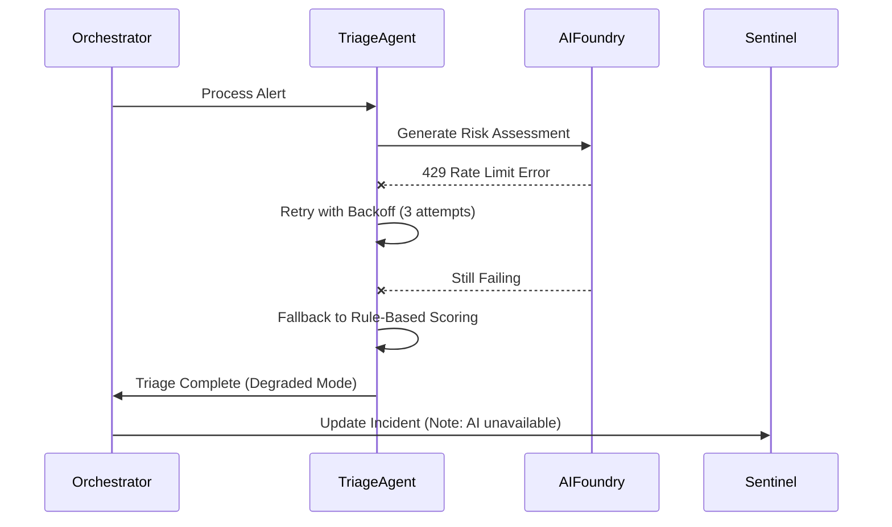
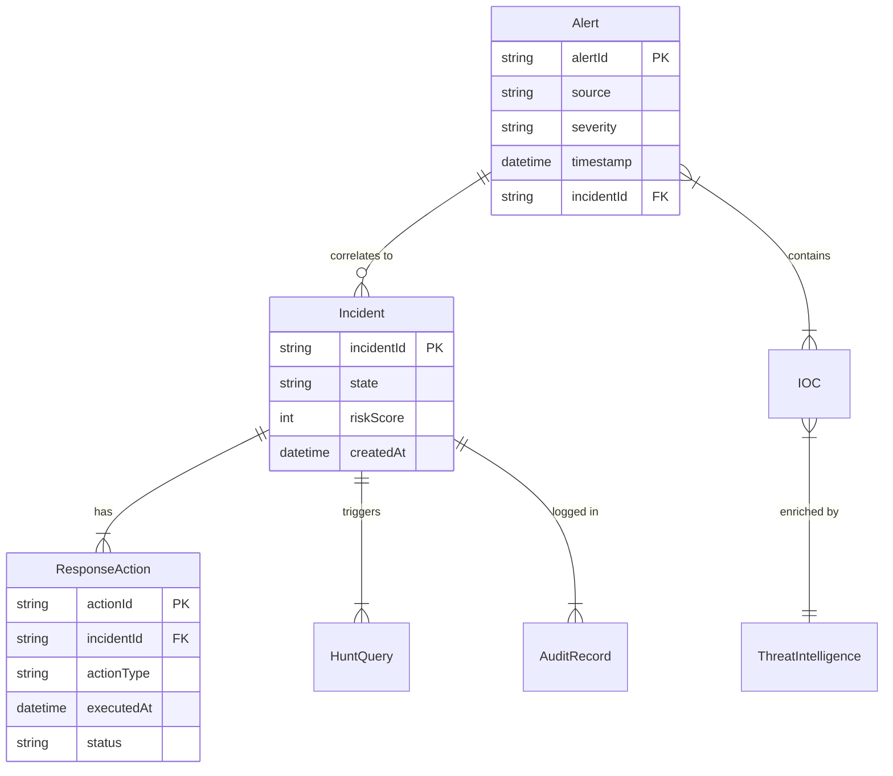

# Pre-Implementation To-Do List

**Purpose**: Non-implementation items that should be clarified or documented before beginning implementation  
**Created**: 2025-11-20  
**Status**: Action Items for Specification & Architecture Refinement

---

## Overview

This document consolidates actionable items from the Judge Review that should be addressed **before or during early implementation** to ensure clarity, reduce rework, and validate architectural decisions. Items that can reasonably be defined at implementation time are noted as such or excluded.

**Key Principle**: Focus on decisions that materially impact implementation approach, integration contracts, or cross-cutting concerns. Implementation details (specific algorithms, data structures, code organization) can be determined during development.

---

## Priority 1: Critical Specification Gaps (Address Before Implementation)

### 1. Quantify Non-Functional Requirements (NFRs)

**Current State**: NFRs use vague terms like "within seconds" and "near real-time"

**Action Required**:
- [ ] Add specific performance SLAs to spec.md:
  - Alert ingestion latency: **< 2 seconds at 95th percentile**
  - Alert triage processing: **< 5 seconds at 95th percentile**
  - Containment action execution: **< 60 seconds at 95th percentile**
  - Hunt query (Sentinel): **< 30 seconds at 95th percentile**
  - Hunt query (Fabric deep search): **< 5 minutes at 95th percentile**
- [ ] Specify availability target in spec.md: **99.5% uptime** (already in architecture, needs to be in requirements)
- [ ] Define throughput targets:
  - MVP: **10,000 alerts/day sustained**
  - Production: **100,000+ alerts/day sustained**

**Where to Add**: Create new section in `spec.md` after line 193 (General System Requirements):

```markdown
#### Performance Requirements

- **FR-054**: Alert ingestion MUST process incoming alerts with latency < 2 seconds at 95th percentile
- **FR-055**: Alert triage MUST complete analysis within 5 seconds at 95th percentile
- **FR-056**: Containment actions MUST execute within 60 seconds at 95th percentile
- **FR-057**: System MUST sustain processing of 10,000 alerts/day in MVP, 100,000+ alerts/day in production
- **FR-058**: System MUST maintain 99.5% uptime (43 minutes maximum downtime per month)
```

**Rationale**: These are not implementation details - they're requirements that drive architecture decisions (caching strategy, async processing, infrastructure sizing). Define them now to guide implementation.

---

### 2. Define API Contracts and Event Schemas

**Current State**: Agent interfaces mentioned but no formal contracts

**Action Required**:
- [ ] Create `/api-specs` directory in repository
- [ ] Define OpenAPI 3.0 specifications for each agent's REST interface:
  - `alert-triage-agent-api.yaml`
  - `threat-hunting-agent-api.yaml`
  - `incident-response-agent-api.yaml`
  - `threat-intelligence-agent-api.yaml`
- [ ] Define JSON schemas for Event Hubs messages:
  - `alert-ingestion-event.schema.json` (Microsoft Graph Security format)
  - `triage-complete-event.schema.json`
  - `response-complete-event.schema.json`
  - `hunt-trigger-event.schema.json`
- [ ] Document orchestrator API (if agents are invoked via HTTP vs events)

**Example Structure** (Alert Triage Agent API):
```yaml
openapi: 3.0.0
info:
  title: Alert Triage Agent API
  version: 1.0.0
  description: Analyzes security alerts and provides risk-based prioritization

paths:
  /triage:
    post:
      summary: Triage a security alert
      requestBody:
        required: true
        content:
          application/json:
            schema:
              $ref: '#/components/schemas/Alert'
      responses:
        200:
          description: Triage completed successfully
          content:
            application/json:
              schema:
                $ref: '#/components/schemas/TriageResult'
        
components:
  schemas:
    Alert:
      type: object
      required: [alertId, source, severity, entities, timestamp]
      properties:
        alertId:
          type: string
          description: Unique alert identifier
        source:
          type: string
          enum: [Sentinel, DefenderEndpoint, DefenderIdentity, DefenderCloud]
        severity:
          type: string
          enum: [Critical, High, Medium, Low, Informational]
        # ... additional fields
    
    TriageResult:
      type: object
      properties:
        riskScore:
          type: integer
          minimum: 0
          maximum: 100
        priority:
          type: string
          enum: [Critical, High, Medium, Low]
        rationale:
          type: string
          description: Natural language explanation of risk assessment
        # ... additional fields
```

**Rationale**: API contracts enable parallel development, clear integration points, and contract testing. These are architectural decisions, not implementation details.

**Note**: Can start with skeleton contracts and refine during implementation, but establish structure now.

---

### 3. Document Security Threat Model

**Current State**: Architecture mentions security controls but lacks formal threat model

**Action Required**:
- [ ] Create `THREAT-MODEL.md` in `/specs/001-agentic-soc/`
- [ ] Conduct STRIDE analysis for each trust boundary:
  - **Spoofing**: How do we verify agent identities? (Managed Identity)
  - **Tampering**: How do we prevent message tampering? (Signed events, TLS)
  - **Repudiation**: How do we ensure auditability? (Immutable logs)
  - **Information Disclosure**: How do we protect sensitive data? (Encryption, RBAC)
  - **Denial of Service**: How do we prevent resource exhaustion? (Rate limiting, quotas)
  - **Elevation of Privilege**: How do we prevent unauthorized actions? (RBAC, approval workflows)
- [ ] Document trust boundaries with diagram:
  - External (Internet) → Azure Firewall → Application Gateway → AKS
  - Agents → Azure Services (Sentinel, Defender, Entra) via Managed Identity
  - Agents → AI Foundry via private endpoint
  - Agents → Data Services (Cosmos DB, Event Hubs) via private endpoint
- [ ] Define attack surface:
  - REST APIs exposed via Application Gateway
  - Event Hubs ingestion endpoints
  - AI Foundry model endpoints
  - Integration adapters (Sentinel, Defender APIs)
- [ ] Document threat mitigation strategies (already partially done in architecture, consolidate here)

**Template Structure**:
```markdown
# Threat Model

## Trust Boundaries
[Diagram showing trust zones]

## STRIDE Analysis

### Spoofing Threats
| Threat | Likelihood | Impact | Mitigation |
|--------|------------|--------|------------|
| Attacker impersonates agent identity | Low | High | Managed Identity with Entra ID, no shared secrets |

[Continue for all STRIDE categories]

## Attack Surface
- REST APIs: [details]
- Event ingestion: [details]
- External integrations: [details]

## Security Controls
[Reference architecture doc sections]
```

**Rationale**: Threat modeling is an architectural activity, not implementation. It informs design decisions (authentication mechanisms, encryption requirements, network isolation). Do this before implementation to avoid rework.

---

## Priority 2: Architecture Clarifications (Define During Early Implementation)

### 4. Clarify Multi-Region Failover Strategy

**Current State**: Production mentions multi-region but strategy is vague

**Action Required**:
- [ ] Document in `AgenticSOC_Architecture.md` (add new section after line 1176):
  - **Primary Region**: East US 2
  - **Secondary Region**: West US 2
  - **Failover Model**: Active-Passive (Cosmos DB auto-failover, manual app deployment trigger)
  - **Failover Triggers**:
    - Primary region unavailable > 15 minutes (Azure health dashboard)
    - Critical service outage affecting > 50% of incidents
    - Manual trigger by operations team
  - **Failover Process**:
    1. Cosmos DB automatic failover (< 2 minutes)
    2. Event Hubs failover (manual namespace switch)
    3. Deploy application to secondary AKS cluster (pre-provisioned)
    4. Update DNS or Traffic Manager to route to secondary region
  - **Failback Process**: After primary region stable for 24 hours, reverse process
  - **RTO**: 2 hours (manual deployment steps)
  - **RPO**: 5 minutes (Cosmos DB replication lag)

**Rationale**: This clarifies disaster recovery expectations but doesn't require implementation now. Document the strategy, implement DR in Phase 2 (Production).

**Note**: ℹ️ DR testing and runbooks can be deferred to production phase. Document the strategy now.

---

### 5. Define Agent Decision-Making Algorithms

**Current State**: Risk scoring and decision logic mentioned but not specified

**Action Required** (Define during implementation, document outcomes):
- [ ] **Alert Triage Risk Scoring Algorithm** - Define during implementation:
  - Factors: Alert severity (0-25 points), Asset criticality (0-25), User risk score (0-25), Threat intel reputation (0-25)
  - Weighting: Can be tuned during implementation based on test data
  - Output: Risk score 0-100, mapped to priority (Critical: 85-100, High: 70-84, Medium: 50-69, Low: <50)
  - **Action**: Document algorithm in code comments and agent README, not in spec
  
- [ ] **Threat Hunting Anomaly Detection** - Define during implementation:
  - Approach: Combination of rule-based (known patterns) + ML-based (anomaly detection)
  - ML model selection: Can be Azure ML anomaly detection, statistical outliers, or LLM-based pattern recognition
  - **Action**: Determine during agent development, document in agent design doc

- [ ] **Incident Response Playbook Selection** - Define during implementation:
  - Logic: Map incident type → playbook (e.g., malware detection → isolate + dump memory + scan)
  - Can use decision tree or LLM-based selection
  - **Action**: Start with simple mapping, evolve based on feedback

**Rationale**: ℹ️ These are implementation details best determined when building the agents. Documenting upfront risks over-specification. Define these as you implement, then document the chosen approach.

---

### 6. Specify Structured Logging Schema

**Current State**: Structured logging mentioned but schema not defined

**Action Required**:
- [ ] Create `LOGGING-SCHEMA.md` in `/specs/001-agentic-soc/`
- [ ] Define JSON log schema with required fields:

```json
{
  "timestamp": "2025-11-20T19:00:00.000Z",
  "level": "INFO|WARN|ERROR|DEBUG",
  "correlationId": "uuid",
  "incidentId": "INC-2025-1234",
  "agentName": "AlertTriageAgent",
  "agentVersion": "1.0.0",
  "operation": "TriageAlert",
  "message": "Alert triaged with risk score 85",
  "properties": {
    "alertId": "abc123",
    "riskScore": 85,
    "priority": "Critical",
    "processingTimeMs": 2345
  },
  "rationale": "High risk due to critical asset involvement and known threat actor IOC",
  "exception": null
}
```

- [ ] Define log levels and usage:
  - **DEBUG**: Detailed diagnostic info (disabled in production)
  - **INFO**: Normal operations (agent decisions, actions taken)
  - **WARN**: Unexpected but handled situations (API timeout with retry)
  - **ERROR**: Failures requiring attention (unable to complete operation)
- [ ] Specify PII handling: Redact credentials, mask partial PII (email → u***@contoso.com)

**Rationale**: Logging schema is cross-cutting and affects all agents. Define early to ensure consistency.

---

### 7. Create Monitoring & Alerting Matrix

**Current State**: Monitoring strategy mentioned but specifics missing

**Action Required**:
- [ ] Create `MONITORING-ALERTING.md` in `/specs/001-agentic-soc/`
- [ ] Define key metrics to track:

| Metric | Type | Threshold | Alert Severity | Notification |
|--------|------|-----------|----------------|--------------|
| Alert processing latency p95 | Performance | > 10 seconds | Warning | Teams channel |
| Alert processing latency p95 | Performance | > 30 seconds | Critical | Page on-call |
| Triage agent error rate | Reliability | > 5% | Warning | Teams channel |
| Triage agent error rate | Reliability | > 10% | Critical | Page on-call |
| Event Hub consumer lag | Reliability | > 1000 messages | Warning | Teams channel |
| Cosmos DB throttling | Performance | > 10 requests/min | Warning | Teams channel |
| AI Foundry rate limit errors | Integration | > 5 errors/min | Warning | Teams channel |
| Agent availability | Reliability | < 99% | Critical | Page on-call |

- [ ] Define dashboard views:
  - **Executive Dashboard**: Incidents/day, MTTR, false positive rate, agent accuracy
  - **Operational Dashboard**: Latency, throughput, error rates, queue depth, resource utilization
- [ ] Specify alert escalation:
  - Warning → Teams channel, email to SOC team
  - Critical → Page on-call engineer, escalate to manager after 15 minutes

**Rationale**: Alerting thresholds are operational decisions that should be defined before implementation to guide instrumentation.

---

## Priority 3: Documentation Enhancements (Complete During Implementation)

### 8. Add Cost Breakdown and FinOps Section

**Current State**: Cost estimates provided ($250/month MVP, $11K/month production) but no breakdown

**Action Required** (Optional - can defer to production planning):
- [ ] Add cost breakdown table to `AgenticSOC_Architecture.md`:

**MVP Cost Breakdown**:
| Service | Tier | Monthly Cost | Notes |
|---------|------|--------------|-------|
| Azure Functions | Consumption | $20 | Pay per execution |
| Cosmos DB | Serverless | $25 | Auto-scale, pay per RU |
| Event Hubs | Basic (1 TU) | $10 | 1M messages/day capacity |
| Redis Cache | Basic 250MB | $15 | Alert deduplication |
| AI Foundry | Pay-as-you-go | $100 | ~1M GPT-4 tokens |
| AI Search | Basic | $75 | Vector search |
| **Total** | | **~$250/month** | |

**Production Cost Breakdown**:
| Service | Tier | Monthly Cost | Optimization Strategy |
|---------|------|--------------|----------------------|
| AKS | Standard, 10 nodes | $1,500 | Reserved instances (-30%) |
| Cosmos DB | Provisioned, multi-region | $1,000 | Autoscale, optimize RU allocation |
| Event Hubs | Premium, 2 CUs | $2,500 | Right-size capacity, use capture |
| Redis Enterprise | Standard | $500 | Consolidate databases |
| AI Foundry | Provisioned | $3,000 | Reserved capacity (-20%) |
| AI Search | Standard, 3 replicas | $750 | Evaluate usage, downgrade if possible |
| Fabric | 1TB/month | $500 | Lifecycle policies (hot→cool→archive) |
| Networking | Firewall, AppGw | $1,000 | Minimize cross-region traffic |
| Monitoring | Log Analytics, App Insights | $250 | Sampling, retention policies |
| **Total** | | **~$11,000/month** | **Potential 20-30% savings with optimization** |

- [ ] Add cost optimization recommendations:
  - Use Azure Hybrid Benefit for Windows licenses
  - Purchase 3-year reservations for predictable workloads
  - Implement auto-shutdown for dev/test environments
  - Set up Azure Cost Management budgets and alerts

**Rationale**: ℹ️ Cost breakdown is helpful but not critical for implementation. Can add during or after MVP development.

---

### 9. Enhance Sequence Diagrams with Error Paths

**Current State**: Sequence diagrams show happy paths only

**Action Required** (Optional):
- [ ] Add error path sequence diagrams to `AgenticSOC_Architecture.md`:
  - **Alert Triage Failure**: What happens if AI Foundry API fails?
  - **Response Agent Action Failure**: What happens if containment API call fails?
  - **Approval Timeout**: What happens if no human response within 15 minutes?
  - **Orchestration Failure**: What happens if Event Hubs is unavailable?

**Example** (Alert Triage Failure):


**Rationale**: ℹ️ Error paths are valuable but can be added incrementally as you implement error handling. Not a blocker for starting implementation.

---

### 10. Create Data Model ERD

**Current State**: Entities defined in spec but no visual data model

**Action Required** (Optional):
- [ ] Create entity-relationship diagram showing:
  - Alert → Incident (many-to-one via correlation)
  - Incident → Response Actions (one-to-many)
  - Incident → Hunt Queries (one-to-many)
  - Alert → IOCs (many-to-many)
  - IOC → Threat Intelligence (many-to-one)
  - Incident → Audit Records (one-to-many)

**Example**:


**Rationale**: ℹ️ ERD is helpful for understanding relationships but not required to start implementation. Cosmos DB schema is flexible. Can create during implementation.

---

## Items That Can Be Defined During Implementation

The following items were identified in the review but can reasonably be defined **during implementation**:

### ✅ Deferred to Implementation Time

1. **Prompt Engineering Details** - Start with basic prompts, iterate based on results
2. **ML Model Evaluation Metrics** - Define after collecting initial data
3. **Fine-Tuning Strategy** - Decide after baseline performance established
4. **Agent Coordination Message Payloads** - Refine as you implement orchestration
5. **State Consistency Model** - Implement basic approach, optimize if issues arise
6. **Specific Caching Strategies** - Implement based on observed performance bottlenecks
7. **Query Optimization Techniques** - Optimize after identifying slow queries
8. **Backup/Restore Procedures** - Define during production planning, not MVP
9. **Chaos Engineering Experiments** - Conduct after MVP is stable
10. **Performance Testing Environment** - Set up during testing phase, not upfront
11. **Development Environment Standards** (linting, formatting) - Establish as you write code
12. **Agent Reflexion and Learning Pipeline** - Phase 2 enhancement after MVP proven

**Rationale**: These are implementation details or Phase 2 enhancements. Don't over-specify upfront. Make pragmatic decisions during development, document what you built.

---

## Summary Checklist

### Must Do Before Starting Implementation (Priority 1)
- [ ] Quantify NFRs with specific SLAs (FR-054 through FR-058)
- [ ] Create skeleton API contracts (OpenAPI specs for all 4 agents)
- [ ] Define Event Hub message schemas (JSON schemas)
- [ ] Document security threat model (STRIDE analysis, trust boundaries)

### Should Do During Early Implementation (Priority 2)
- [ ] Clarify multi-region failover strategy (document approach, implement later)
- [ ] Define structured logging schema (JSON format with required fields)
- [ ] Create monitoring & alerting matrix (metrics, thresholds, notifications)

### Nice to Have (Priority 3)
- [ ] Add cost breakdown and FinOps section
- [ ] Enhance sequence diagrams with error paths
- [ ] Create data model ERD

### Deferred to Implementation Time
- [ ] All items listed in "Items That Can Be Defined During Implementation" section

---

## Next Steps

1. **Address Priority 1 items** (1-2 days):
   - Update `spec.md` with quantified NFRs
   - Create `/api-specs` directory with skeleton OpenAPI files
   - Create `THREAT-MODEL.md` with STRIDE analysis
   
2. **Address Priority 2 items** (1 day):
   - Update architecture doc with failover strategy
   - Create `LOGGING-SCHEMA.md`
   - Create `MONITORING-ALERTING.md`

3. **Begin Implementation**:
   - Start with Alert Triage Agent
   - Refine API contracts and schemas as you build
   - Document decisions and learnings

**Total Effort for Pre-Implementation Cleanup**: 2-3 days

**Expected Outcome**: Clearer specification, reduced ambiguity, lower rework risk during implementation.

---

**Document Version**: 1.0  
**Created**: 2025-11-20  
**Purpose**: Consolidate non-implementation to-dos from Judge Review  
**Status**: Ready for action
