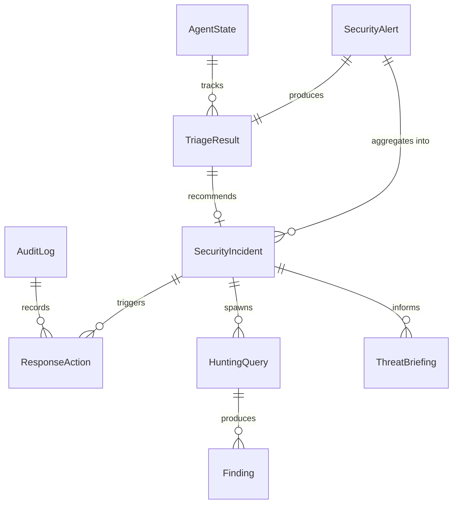

# Phase 1: Data Model & Entity Definitions

**Date**: 2025-11-21  
**Phase**: 1 (Design - Data Model)  
**Status**: Complete

This document defines the core entities, data models, and schemas for the Agentic SOC MVP. These models align with Microsoft Sentinel/Graph Security API schemas where applicable and extend them for agent-specific requirements.

---

## Data Model Strategy: SDK Alignment & Custom Extensions

### Relationship to Microsoft SDKs and Frameworks

**Q: Are these data structures provided by the SDKs/frameworks we're using?**

**A: Partial overlap with intentional custom extensions**

#### 1. SecurityAlert & SecurityIncident (SDK-Provided)

**Source**: Microsoft Sentinel / Defender XDR APIs
- ✅ **SecurityAlert**: Schema matches [Microsoft Sentinel SecurityAlert table](https://learn.microsoft.com/en-us/azure/defender-for-cloud/alerts-schemas)
- ✅ **SecurityIncident**: Schema matches [Microsoft Sentinel SecurityIncident table](https://learn.microsoft.com/en-us/azure/sentinel/manage-soc-with-incident-metrics#securityincidents-schema)

**Rationale for Pydantic Models**:
- SDK returns JSON/dict → We add **type safety** with Pydantic validation
- Sentinel API uses camelCase → We maintain compatibility but add **validation rules**
- **No SDK provides Pydantic models** → We create them for type-safe agent code

```python
# WITHOUT Pydantic (SDK raw response)
alert = sentinel_client.get_alert(alert_id)  # Returns dict
# Risk: No type checking, easy to miss fields

# WITH Pydantic (our models)
alert = SecurityAlert(**sentinel_client.get_alert(alert_id))  # Validated
# Benefit: IDE autocomplete, runtime validation, serialization
```

#### 2. Agent-Specific Entities (Custom, Not in SDKs)

These entities are **unique to our agentic architecture** and **not provided by any SDK**:

| Entity | SDK Provided? | Rationale for Custom Model |
|--------|---------------|----------------------------|
| **TriageResult** | ❌ No | Agent output schema - risk scores, decisions, explanations. Sentinel has no concept of "AI triage result". |
| **HuntingQuery** | ❌ No | Natural language → KQL workflow. Sentinel API accepts KQL strings, not natural language queries. |
| **ResponseAction** | ❌ No | Containment actions with risk-based approval. Defender has "remediation actions" but not our human-in-loop approval workflow. |
| **ThreatBriefing** | ❌ No | AI-generated daily intelligence briefing. No SDK provides this. |
| **AgentState** | ❌ No | Persistent agent execution state. Microsoft Agent Framework has session state, but not our domain-specific metrics. |
| **AuditLog** | ❌ No | Immutable compliance trail for agent actions. Sentinel has audit logs for human actions, not AI agent actions. |

#### 3. Microsoft Agent Framework Integration

**Agent Framework Provides**:
- `ChatMessage`, `ChatAgent`, `Role` - Conversation primitives
- `AFBaseModel` - Pydantic-compatible base for serialization
- `AgentRunContext`, `AgentMiddleware` - Execution pipeline

**We Extend With**:
```python
from agent_framework import ChatAgent, ChatMessage, Role
from agent_framework._pydantic import AFBaseModel  # Pydantic compatibility

# Our domain model extends AF primitives
class TriageResult(AFBaseModel):  # Uses Agent Framework's Pydantic base
    triageId: UUID4
    alertId: UUID4
    riskScore: int  # 0-100
    priority: PriorityLevel
    triageDecision: TriageDecision
    explanation: str
    # ... agent-specific fields not in any SDK
```

**Why Not Use SDK Models Directly?**:
1. **Sentinel SDK** (azure-mgmt-securityinsight): Management plane only, no data models
2. **Defender SDK** (microsoft-graph): Returns generic dicts/JSON, no Pydantic models
3. **Agent Framework**: Provides conversation primitives, not security domain models

#### 4. Cosmos DB Schema

**SDK**: `azure-cosmos` provides CRUD operations, **not** schema definitions

**Our Approach**:
- Define Pydantic models → Serialize to JSON → Store in Cosmos DB
- Cosmos DB is schemaless (NoSQL) → Our Pydantic models enforce schema at application layer
- Partitioning strategy (`/Severity`, `/AgentName`) is custom, not SDK-provided

```python
from azure.cosmos import CosmosClient

# SDK provides client, not schema
cosmos_client = CosmosClient(endpoint, credential)
container = cosmos_client.get_database_client("agentic-soc").get_container_client("alerts")

# Our Pydantic model enforces schema
alert = SecurityAlert(**raw_alert_data)  # Validates against our schema
container.create_item(alert.model_dump())  # Serialize to JSON for Cosmos
```

---

## 1. Core Entity: SecurityAlert

**Purpose**: Represents a security alert from any source (Sentinel, Defender, mock data stream)

**Schema** (based on Microsoft Sentinel Alert schema):

```json
{
  "SystemAlertId": "string (UUID)",
  "AlertName": "string",
  "AlertType": "string (unique identifier)",
  "Severity": "enum: High|Medium|Low|Informational",
  "Description": "string",
  "TimeGenerated": "datetime (ISO 8601)",
  "StartTime": "datetime (ISO 8601)",
  "EndTime": "datetime (ISO 8601)",
  "Entities": [
    {
      "Type": "enum: Account|Host|IP|File|Process|URL|MailMessage|CloudApplication",
      "Properties": "object (type-specific fields)"
    }
  ],
  "ExtendedProperties": {
    "MitreTechniques": ["string (ATT&CK technique IDs)"],
    "DataSources": ["string"],
    "ConfidenceScore": "number (0-100)",
    "ThreatCategory": "string"
  },
  "ProviderName": "string (e.g., 'Microsoft Sentinel', 'Microsoft Defender')",
  "ProductName": "string",
  "RemediationSteps": ["string"],
  "ResourceId": "string (affected resource ARM ID)"
}
```

**Pydantic Model** (Python):

```python
from pydantic import BaseModel, Field, UUID4
from datetime import datetime
from typing import List, Dict, Any, Optional
from enum import Enum

class SeverityLevel(str, Enum):
    HIGH = "High"
    MEDIUM = "Medium"
    LOW = "Low"
    INFORMATIONAL = "Informational"

class EntityType(str, Enum):
    ACCOUNT = "Account"
    HOST = "Host"
    IP = "IP"
    FILE = "File"
    PROCESS = "Process"
    URL = "URL"
    MAIL_MESSAGE = "MailMessage"
    CLOUD_APPLICATION = "CloudApplication"

class AlertEntity(BaseModel):
    Type: EntityType
    Properties: Dict[str, Any]

class SecurityAlert(BaseModel):
    SystemAlertId: UUID4
    AlertName: str
    AlertType: str
    Severity: SeverityLevel
    Description: str
    TimeGenerated: datetime
    StartTime: datetime
    EndTime: datetime
    Entities: List[AlertEntity]
    ExtendedProperties: Dict[str, Any] = Field(default_factory=dict)
    ProviderName: str
    ProductName: str
    RemediationSteps: List[str] = Field(default_factory=list)
    ResourceId: Optional[str] = None
    
    class Config:
        json_schema_extra = {
            "example": {
                "SystemAlertId": "550e8400-e29b-41d4-a716-446655440000",
                "AlertName": "Suspicious PowerShell Execution",
                "AlertType": "SuspiciousPowerShell",
                "Severity": "High",
                "Description": "PowerShell executed with suspicious parameters",
                "TimeGenerated": "2025-11-21T10:30:00Z",
                "StartTime": "2025-11-21T10:29:45Z",
                "EndTime": "2025-11-21T10:30:15Z",
                "Entities": [
                    {"Type": "Host", "Properties": {"HostName": "WS-001"}},
                    {"Type": "Process", "Properties": {"ProcessName": "powershell.exe"}}
                ],
                "ProviderName": "Microsoft Defender for Endpoint",
                "ProductName": "Defender ATP"
            }
        }
```

---

## 2. Core Entity: SecurityIncident

**Purpose**: Represents a security incident (correlated alerts, investigation state)

**Schema** (based on Microsoft Sentinel Incident schema):

```json
{
  "IncidentId": "string (UUID)",
  "IncidentNumber": "integer (auto-increment)",
  "Title": "string",
  "Description": "string",
  "Severity": "enum: High|Medium|Low|Informational",
  "Status": "enum: New|Investigating|Contained|Resolved|Closed",
  "Classification": "enum: TruePositive|BenignPositive|FalsePositive|Undetermined",
  "ClassificationReason": "string",
  "ClassificationComment": "string",
  "Owner": {
    "AssignedTo": "string (user principal name)",
    "AssignedAt": "datetime (ISO 8601)"
  },
  "CreatedTime": "datetime (ISO 8601)",
  "FirstActivityTime": "datetime (ISO 8601)",
  "LastActivityTime": "datetime (ISO 8601)",
  "LastModifiedTime": "datetime (ISO 8601)",
  "ClosedTime": "datetime (ISO 8601, nullable)",
  "AlertIds": ["string (SystemAlertId references)"],
  "Entities": [
    {
      "Type": "enum: Account|Host|IP|File|Process|URL|MailMessage|CloudApplication",
      "Properties": "object"
    }
  ],
  "Labels": ["string (tags)"],
  "RelatedAnalyticRuleIds": ["string"],
  "MitreTechniques": ["string (ATT&CK IDs)"],
  "Comments": [
    {
      "CommentId": "string (UUID)",
      "Author": "string (user or agent name)",
      "Message": "string",
      "CreatedTime": "datetime (ISO 8601)"
    }
  ],
  "AdditionalData": {
    "AlertCount": "integer",
    "BookmarkCount": "integer",
    "AlertProductNames": ["string"],
    "Tactics": ["string (MITRE tactics)"]
  }
}
```

**Incident Lifecycle States**:

```
New → Investigating → Contained → Resolved → Closed
  ↓         ↓            ↓           ↓
  └─────────┴────────────┴───────────→ (can escalate back)
```

---

## 3. Agent-Specific Entity: TriageResult

**Purpose**: Output from Alert Triage Agent

```json
{
  "AlertId": "string (SystemAlertId reference)",
  "TriageId": "string (UUID)",
  "Timestamp": "datetime (ISO 8601)",
  "RiskScore": "integer (0-100)",
  "Priority": "enum: Critical|High|Medium|Low",
  "TriageDecision": "enum: EscalateToIncident|CorrelateWithExisting|MarkAsFalsePositive|RequireHumanReview",
  "Explanation": "string (natural language rationale)",
  "CorrelatedAlertIds": ["string"],
  "RecommendedIncidentId": "string (UUID, nullable)",
  "EnrichmentData": {
    "AssetCriticality": "enum: Critical|High|Medium|Low",
    "UserRiskLevel": "enum: High|Medium|Low",
    "ThreatIntelligenceMatches": [
      {
        "IOC": "string",
        "IOCType": "enum: IP|Domain|FileHash|URL",
        "Reputation": "enum: Malicious|Suspicious|Unknown|Benign",
        "Source": "string"
      }
    ]
  },
  "ProcessingTimeMs": "integer",
  "AgentVersion": "string"
}
```

**Pydantic Model**:

```python
class TriagePriority(str, Enum):
    CRITICAL = "Critical"
    HIGH = "High"
    MEDIUM = "Medium"
    LOW = "Low"

class TriageDecision(str, Enum):
    ESCALATE_TO_INCIDENT = "EscalateToIncident"
    CORRELATE_WITH_EXISTING = "CorrelateWithExisting"
    MARK_AS_FALSE_POSITIVE = "MarkAsFalsePositive"
    REQUIRE_HUMAN_REVIEW = "RequireHumanReview"

class ThreatIntelMatch(BaseModel):
    IOC: str
    IOCType: str
    Reputation: str
    Source: str

class TriageResult(BaseModel):
    AlertId: UUID4
    TriageId: UUID4
    Timestamp: datetime
    RiskScore: int = Field(ge=0, le=100)
    Priority: TriagePriority
    TriageDecision: TriageDecision
    Explanation: str
    CorrelatedAlertIds: List[UUID4] = Field(default_factory=list)
    RecommendedIncidentId: Optional[UUID4] = None
    EnrichmentData: Dict[str, Any] = Field(default_factory=dict)
    ProcessingTimeMs: int
    AgentVersion: str
```

---

## 4. Agent-Specific Entity: HuntingQuery

**Purpose**: Represents a threat hunting query (natural language or KQL)

```json
{
  "QueryId": "string (UUID)",
  "QueryName": "string",
  "NaturalLanguage": "string (original analyst question)",
  "KQL": "string (generated KQL query)",
  "DataSources": ["string (table names)"],
  "MitreTechniques": ["string (relevant ATT&CK techniques)"],
  "CreatedBy": "string (analyst or 'AutomatedHunt')",
  "CreatedTime": "datetime (ISO 8601)",
  "ExecutionTime": "datetime (ISO 8601, nullable)",
  "ExecutionDurationMs": "integer (nullable)",
  "ResultCount": "integer (nullable)",
  "Status": "enum: Pending|Running|Completed|Failed",
  "Findings": [
    {
      "FindingId": "string (UUID)",
      "SuspiciousEntity": "object (entity that triggered finding)",
      "AnomalyScore": "number (0-100)",
      "Description": "string",
      "RecommendedAction": "string"
    }
  ]
}
```

---

## 5. Agent-Specific Entity: ResponseAction

**Purpose**: Represents a containment/response action

```json
{
  "ActionId": "string (UUID)",
  "IncidentId": "string (UUID reference)",
  "ActionType": "enum: IsolateEndpoint|DisableAccount|BlockIP|QuarantineFile|TerminateProcess|ResetPassword",
  "TargetEntity": {
    "EntityType": "enum: Host|Account|IP|File|Process",
    "EntityId": "string",
    "EntityName": "string"
  },
  "Status": "enum: Pending|ApprovalRequired|Approved|Executing|Completed|Failed|Cancelled",
  "RequestedBy": "string (agent or analyst)",
  "RequestedTime": "datetime (ISO 8601)",
  "ApprovedBy": "string (user principal name, nullable)",
  "ApprovedTime": "datetime (ISO 8601, nullable)",
  "ExecutedTime": "datetime (ISO 8601, nullable)",
  "CompletedTime": "datetime (ISO 8601, nullable)",
  "RiskLevel": "enum: Critical|High|Medium|Low",
  "RequiresApproval": "boolean",
  "Rationale": "string (AI-generated explanation)",
  "PlaybookId": "string (UUID, nullable)",
  "ExecutionDetails": {
    "CommandExecuted": "string",
    "ResultCode": "integer",
    "ResultMessage": "string",
    "AffectedResources": ["string"]
  }
}
```

**Risk-Based Approval Matrix**:

| Action Type | Asset Criticality | Auto-Approved | Requires Approval |
|-------------|-------------------|---------------|-------------------|
| IsolateEndpoint | Low/Medium | ✅ Yes | ❌ No |
| IsolateEndpoint | High/Critical | ❌ No | ✅ Yes (human) |
| DisableAccount | Standard User | ✅ Yes | ❌ No |
| DisableAccount | Admin/Service Account | ❌ No | ✅ Yes (human) |
| BlockIP | External IP | ✅ Yes | ❌ No |
| BlockIP | Internal Subnet | ❌ No | ✅ Yes (human) |

---

## 6. Agent-Specific Entity: ThreatBriefing

**Purpose**: Daily threat intelligence briefing generated by Intelligence Agent

```json
{
  "BriefingId": "string (UUID)",
  "BriefingDate": "date (YYYY-MM-DD)",
  "GeneratedTime": "datetime (ISO 8601)",
  "ExecutiveSummary": "string (natural language)",
  "KeyThreats": [
    {
      "ThreatName": "string",
      "Severity": "enum: Critical|High|Medium|Low",
      "MitreTechniques": ["string"],
      "AffectedAssets": ["string"],
      "RecommendedActions": ["string"]
    }
  ],
  "TrendingAttackPatterns": [
    {
      "Pattern": "string (e.g., 'Credential Dumping')",
      "IncreasePercentage": "number",
      "RelatedIncidents": ["string (IncidentId references)"]
    }
  ],
  "EmergingThreats": [
    {
      "ThreatDescription": "string",
      "Source": "string (e.g., 'Attack Dataset', 'MITRE')",
      "Relevance": "string (why relevant to organization)"
    }
  ],
  "IOCs": [
    {
      "Value": "string",
      "Type": "enum: IP|Domain|FileHash|URL",
      "Reputation": "enum: Malicious|Suspicious",
      "FirstSeen": "datetime (ISO 8601)",
      "Context": "string"
    }
  ]
}
```

---

## 7. Shared Entity: AgentState

**Purpose**: Persistent state for each agent instance

```json
{
  "AgentId": "string (UUID)",
  "AgentName": "string (e.g., 'AlertTriageAgent')",
  "AgentVersion": "string (semver)",
  "Status": "enum: Idle|Processing|Error|Maintenance",
  "LastHeartbeat": "datetime (ISO 8601)",
  "ProcessingQueue": {
    "PendingTasks": "integer",
    "AverageProcessingTimeMs": "number"
  },
  "Metrics": {
    "TotalTasksProcessed": "integer",
    "SuccessRate": "number (0-100)",
    "AverageLatencyMs": "number",
    "ErrorCount": "integer"
  },
  "Configuration": {
    "ModelDeploymentName": "string",
    "Temperature": "number (0-1)",
    "MaxTokens": "integer",
    "CustomInstructions": "string"
  },
  "LastModelUpdate": "datetime (ISO 8601, nullable)",
  "FeedbackSummary": {
    "PositiveFeedback": "integer",
    "NegativeFeedback": "integer",
    "FeedbackScore": "number (0-100)"
  }
}
```

---

## 8. Shared Entity: AuditLog

**Purpose**: Immutable audit trail for compliance

```json
{
  "LogId": "string (UUID)",
  "Timestamp": "datetime (ISO 8601)",
  "EventType": "enum: AgentAction|HumanAction|SystemEvent",
  "Actor": "string (agent name or user UPN)",
  "ActorType": "enum: Agent|User|System",
  "Action": "string (verb, e.g., 'TriagedAlert', 'ApprovedAction')",
  "TargetEntity": {
    "EntityType": "string",
    "EntityId": "string"
  },
  "Details": "object (action-specific data)",
  "Result": "enum: Success|Failure|PartialSuccess",
  "ErrorMessage": "string (nullable)",
  "CorrelationId": "string (UUID for distributed tracing)",
  "ClientIP": "string (nullable)",
  "UserAgent": "string (nullable)"
}
```

---

## 9. Data Storage Strategy

### Cosmos DB Collections

**Collection: `alerts`**
- Primary Key: `SystemAlertId`
- Partition Key: `/TimeGenerated` (date partition, e.g., "2025-11-21")
- TTL: 5 days (MVP default)

**Collection: `incidents`**
- Primary Key: `IncidentId`
- Partition Key: `/Status`
- TTL: 30 days (MVP default)

**Collection: `triage_results`**
- Primary Key: `TriageId`
- Partition Key: `/AlertId`
- TTL: 30 days

**Collection: `response_actions`**
- Primary Key: `ActionId`
- Partition Key: `/IncidentId`
- TTL: 90 days

**Collection: `agent_state`**
- Primary Key: `AgentId`
- Partition Key: `/AgentName`
- TTL: None (persistent)

**Collection: `audit_logs`**
- Primary Key: `LogId`
- Partition Key: `/Timestamp` (date partition)
- TTL: 365 days (compliance requirement)

### Microsoft Fabric (Optional - for long-term storage)

**Delta Lake Tables**:
- `bronze.raw_alerts` - Raw alert data (1-year retention)
- `silver.enriched_alerts` - Processed alerts with enrichment (1-year retention)
- `gold.incident_analytics` - Aggregated incident metrics (permanent)

---

## 10. Validation Rules

### Alert Validation

```python
def validate_alert(alert: SecurityAlert) -> bool:
    """Validate alert meets minimum requirements"""
    
    # Must have system alert ID
    if not alert.SystemAlertId:
        raise ValueError("Missing SystemAlertId")
    
    # Must have severity
    if alert.Severity not in ["High", "Medium", "Low", "Informational"]:
        raise ValueError(f"Invalid severity: {alert.Severity}")
    
    # Must have at least one entity
    if len(alert.Entities) == 0:
        raise ValueError("Alert must have at least one entity")
    
    # Time range must be valid
    if alert.EndTime < alert.StartTime:
        raise ValueError("EndTime must be after StartTime")
    
    return True
```

### Incident Lifecycle Validation

```python
VALID_STATUS_TRANSITIONS = {
    "New": ["Investigating", "Closed"],
    "Investigating": ["Contained", "Resolved", "Closed"],
    "Contained": ["Resolved", "Investigating"],
    "Resolved": ["Closed", "Investigating"],
    "Closed": []  # Terminal state
}

def validate_status_transition(current_status: str, new_status: str) -> bool:
    """Validate incident status transition is allowed"""
    return new_status in VALID_STATUS_TRANSITIONS.get(current_status, [])
```

---

## 11. Entity Relationships



---

## Summary

All core entities defined with:
- ✅ JSON schemas aligned with Microsoft Sentinel/Graph Security API
- ✅ Pydantic models for Python type safety
- ✅ Validation rules for data integrity
- ✅ Storage strategy (Cosmos DB collections with TTL)
- ✅ Entity relationships and lifecycle states
- ✅ Agent-specific entities (triage results, hunting queries, response actions)

**Next**: Create API contracts in `contracts/` directory.
