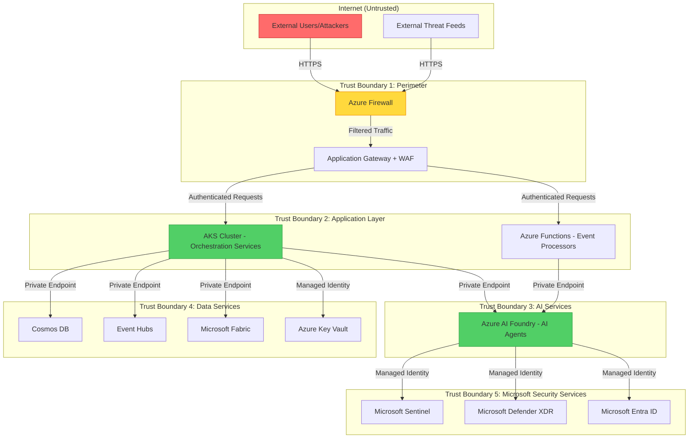

# Agentic SOC - Security Threat Model

**Document Version**: 1.0  
**Created**: 2025-11-20  
**Purpose**: Document security threats, trust boundaries, and mitigation strategies for the Agentic SOC system  
**Methodology**: STRIDE (Spoofing, Tampering, Repudiation, Information Disclosure, Denial of Service, Elevation of Privilege)

---

## Executive Summary

This threat model identifies potential security risks to the Agentic Security Operations Center (SOC) system and documents mitigation strategies. The analysis uses the STRIDE methodology to systematically evaluate threats across all trust boundaries.

**Key Findings**:
- **High-Risk Areas**: Agent authentication, containment action authorization, sensitive data handling
- **Primary Controls**: Azure Managed Identity, RBAC, encryption at rest/transit, immutable audit logs
- **Architecture Strength**: Zero Trust design with defense-in-depth, minimal attack surface

---

## Trust Boundaries

### Trust Boundary Descriptions

1. **Perimeter (Internet → Azure)**
   - Controlled by: Azure Firewall, Application Gateway with WAF
   - Threat Level: **High** - Exposed to internet-based attacks
   - Trust Requirement: Strong authentication, DDoS protection, rate limiting

2. **Application Layer (Orchestration Services)**
   - Controlled by: AKS network policies, Azure AD authentication, RBAC
   - Threat Level: **Medium** - Internal services, authenticated access only
   - Trust Requirement: Service-to-service authentication, least privilege access

3. **AI Services (Azure AI Foundry Agents)**
   - Controlled by: Private endpoints, Managed Identity, API authorization
   - Threat Level: **Medium** - Risk of prompt injection, unauthorized model access
   - Trust Requirement: Input validation, output sanitization, usage monitoring

4. **Data Services**
   - Controlled by: Private endpoints, Managed Identity, encryption, RBAC
   - Threat Level: **Medium** - Contains sensitive security data, audit logs
   - Trust Requirement: Encryption at rest/transit, immutable logs, backup retention

5. **Microsoft Security Services**
   - Controlled by: Managed Identity, Entra ID RBAC, API throttling
   - Threat Level: **Low-Medium** - Trusted Microsoft services, limited to read/write actions
   - Trust Requirement: Principle of least privilege, action audit logging

---

## Attack Surface

### External Attack Surface

| Component | Exposure | Attack Vectors | Mitigation |
|-----------|----------|----------------|------------|
| **Application Gateway** | Public HTTPS endpoints | DDoS, SQL injection, XSS, credential stuffing | WAF rules, rate limiting, TLS 1.3, Entra ID authentication |
| **Event Hubs Ingestion** | Public endpoints (restricted IPs) | Message injection, replay attacks, DoS | Event signature validation, IP allowlisting, connection throttling |
| **Teams Integration** | Microsoft Teams webhook | Phishing, malicious commands, social engineering | Command validation, user authorization, audit logging |

### Internal Attack Surface

| Component | Exposure | Attack Vectors | Mitigation |
|-----------|----------|----------------|------------|
| **AI Foundry Agents** | Private endpoints only | Prompt injection, model poisoning, unauthorized invocation | Input sanitization, output validation, Managed Identity auth |
| **Orchestration Services** | Private network only | Privilege escalation, lateral movement, configuration tampering | RBAC, network segmentation, immutable infrastructure |
| **Data Services** | Private endpoints only | Data exfiltration, unauthorized access, data tampering | Encryption, RBAC, audit logging, private endpoints |
| **Integration Adapters** | API access to Sentinel/Defender | Excessive permissions, credential theft, API abuse | Managed Identity, least privilege RBAC, API monitoring |

---

## STRIDE Analysis

### Spoofing Threats

| Threat | Likelihood | Impact | Mitigation | Residual Risk |
|--------|------------|--------|------------|---------------|
| **Attacker impersonates agent identity to access Microsoft Security services** | Low | High | **Primary**: Azure Managed Identity with Entra ID (no credentials to steal) **Secondary**: Private endpoints prevent external access **Tertiary**: API calls logged to Azure Monitor | **Low** |
| **Malicious actor spoofs Event Hub messages to inject fake alerts** | Low | Medium | **Primary**: Event signature validation using HMAC **Secondary**: Source IP allowlisting **Tertiary**: Alert deduplication logic | **Low** |
| **User impersonates SOC analyst to approve containment actions** | Low | High | **Primary**: Multi-factor authentication (Entra ID) **Secondary**: Approval requests sent to verified Teams channels **Tertiary**: All approvals logged with user identity | **Low** |
| **Attacker spoofs threat intelligence feed to poison agent knowledge** | Medium | Medium | **Primary**: TLS certificate validation for feed connections **Secondary**: Reputation scoring for feed sources **Tertiary**: Human review of high-impact intelligence | **Low-Medium** |

### Tampering Threats

| Threat | Likelihood | Impact | Mitigation | Residual Risk |
|--------|------------|--------|------------|---------------|
| **Attacker modifies Event Hub messages in transit** | Low | Medium | **Primary**: TLS 1.3 encryption for all Event Hub connections **Secondary**: Message integrity validation using checksums **Tertiary**: Detect anomalies via monitoring | **Low** |
| **Malicious insider tampers with Cosmos DB audit logs** | Low | Critical | **Primary**: Cosmos DB continuous backup (immutable 30 days) **Secondary**: RBAC with least privilege (read-only for most) **Tertiary**: Log export to external SIEM (Sentinel) | **Low** |
| **Attacker modifies AI agent code or configuration** | Low | High | **Primary**: Immutable container images (signed, scanned) **Secondary**: GitOps deployment (code review required) **Tertiary**: Configuration stored in Azure App Configuration with change tracking | **Low** |
| **Attacker tampers with containment action parameters** | Low | Critical | **Primary**: Input validation against JSON schemas **Secondary**: Risk threshold checks before execution **Tertiary**: All actions require approval or logged for review | **Low** |

### Repudiation Threats

| Threat | Likelihood | Impact | Mitigation | Residual Risk |
|--------|------------|--------|------------|---------------|
| **Agent denies taking unauthorized containment action** | Low | High | **Primary**: Immutable audit logs in Cosmos DB (all actions logged with agent ID, timestamp, rationale) **Secondary**: Logs replicated to Sentinel for compliance **Tertiary**: Cryptographic signing of critical action records | **Low** |
| **SOC analyst denies approving high-risk action** | Low | Medium | **Primary**: Approval stored with Entra ID user identity, timestamp, IP address **Secondary**: Teams message thread preserved as evidence **Tertiary**: All approvals exported to external audit system | **Low** |
| **User denies making malicious query to hunting agent** | Low | Low | **Primary**: All queries logged with user identity and timestamp **Secondary**: Query results logged for forensic review **Tertiary**: Anomalous query patterns flagged for review | **Low** |

### Information Disclosure Threats

| Threat | Likelihood | Impact | Mitigation | Residual Risk |
|--------|------------|--------|------------|---------------|
| **Attacker gains unauthorized access to security telemetry data** | Low | Critical | **Primary**: All data services use private endpoints (no public access) **Secondary**: Encryption at rest (AES-256) and in transit (TLS 1.3) **Tertiary**: RBAC with just-in-time access for administrators | **Low** |
| **Agent inadvertently exposes PII or credentials in logs** | Medium | High | **Primary**: Log sanitization middleware (redact credentials, mask PII) **Secondary**: Secrets stored only in Azure Key Vault (never in code/logs) **Tertiary**: Automated scanning for leaked secrets (GitHub Advanced Security) | **Low-Medium** |
| **Attacker intercepts AI agent prompts containing sensitive incident data** | Low | High | **Primary**: Private endpoints for AI Foundry (no internet exposure) **Secondary**: TLS 1.3 for all agent communication **Tertiary**: Prompt templates minimize sensitive data in requests | **Low** |
| **Unauthorized user accesses incident details via API** | Medium | Medium | **Primary**: Entra ID authentication required for all API calls **Secondary**: RBAC enforced (analysts can only see incidents they're assigned to) **Tertiary**: API access logged for audit | **Low-Medium** |

### Denial of Service Threats

| Threat | Likelihood | Impact | Mitigation | Residual Risk |
|--------|------------|--------|------------|---------------|
| **Attacker floods Event Hubs with fake alerts to overwhelm system** | Medium | High | **Primary**: Event Hubs throttling (1M events/day in MVP, scalable) **Secondary**: Alert deduplication using Redis cache **Tertiary**: Auto-scaling for processing capacity (AKS horizontal pod autoscaler) | **Low-Medium** |
| **AI Foundry rate limits exceeded due to excessive agent invocations** | Medium | Medium | **Primary**: Request rate limiting in orchestration layer **Secondary**: Circuit breaker pattern (fail fast if AI unavailable) **Tertiary**: Fallback to rule-based triage if AI unavailable | **Low-Medium** |
| **Malicious query exhausts Cosmos DB capacity** | Low | Medium | **Primary**: Cosmos DB request unit (RU) limits per operation **Secondary**: Query timeout enforcement (30 seconds max) **Tertiary**: Monitoring and alerting on RU consumption | **Low** |
| **Attacker causes infinite loop in agent orchestration** | Low | High | **Primary**: Maximum task depth limit (5 levels) **Secondary**: Task timeout enforcement (5 minutes per agent) **Tertiary**: Dead-letter queue for failed/stuck tasks | **Low** |

### Elevation of Privilege Threats

| Threat | Likelihood | Impact | Mitigation | Residual Risk |
|--------|------------|--------|------------|---------------|
| **Attacker exploits agent to execute unauthorized containment actions** | Low | Critical | **Primary**: Risk threshold checks (critical assets require approval) **Secondary**: RBAC on containment APIs (agents have minimal permissions) **Tertiary**: Human-in-the-loop for irreversible actions (account deletion, data wipe) | **Low** |
| **Compromised service account gains access to Key Vault secrets** | Low | Critical | **Primary**: Managed Identity only (no service principals in MVP) **Secondary**: Key Vault RBAC with just-in-time access **Tertiary**: Secret rotation every 90 days, access logged | **Low** |
| **Agent bypasses approval workflow to execute high-risk action** | Low | Critical | **Primary**: Approval checks enforced in orchestration layer (not agent) **Secondary**: Database transaction ensures approval recorded before action **Tertiary**: Post-action verification (did action require approval?) | **Low** |
| **Attacker escalates from analyst role to administrator** | Low | High | **Primary**: Entra ID Privileged Identity Management (time-bound admin access) **Secondary**: Multi-factor authentication for all privileged operations **Tertiary**: All privilege escalations logged and alerted | **Low** |

---

## Security Controls Summary

### Authentication & Authorization

| Control | Implementation | Purpose |
|---------|----------------|---------|
| **Managed Identity** | Azure Managed Identity for all agent-to-service authentication | Eliminate credential theft risk, automatic token management |
| **Entra ID RBAC** | Role-based access control for all user and service access | Enforce least privilege, centralized access management |
| **Private Endpoints** | All data services accessible only via private endpoints | Eliminate public exposure, network isolation |
| **API Authentication** | OAuth 2.0 with Entra ID for all REST APIs | Standardized, secure API access with token expiration |

### Data Protection

| Control | Implementation | Purpose |
|---------|----------------|---------|
| **Encryption at Rest** | AES-256 encryption for Cosmos DB, Fabric, Key Vault | Protect sensitive data from unauthorized access |
| **Encryption in Transit** | TLS 1.3 for all network communication | Prevent eavesdropping and tampering |
| **PII Redaction** | Automated log sanitization (mask emails, redact secrets) | Minimize exposure of personally identifiable information |
| **Secret Management** | Azure Key Vault for all credentials and API keys | Centralized secret storage with access logging |

### Audit & Monitoring

| Control | Implementation | Purpose |
|---------|----------------|---------|
| **Immutable Audit Logs** | Cosmos DB with continuous backup, exported to Sentinel | Ensure non-repudiation, forensic investigation capability |
| **Real-Time Monitoring** | Azure Monitor, Application Insights, custom dashboards | Detect anomalies, track performance, alert on security events |
| **Alert on Suspicious Activity** | Sentinel detection rules for failed auth, privilege escalation, unusual queries | Early warning system for security incidents |
| **Compliance Logging** | All agent actions logged with rationale, timestamp, user/agent identity | Meet audit requirements, provide explainability |

### Application Security

| Control | Implementation | Purpose |
|---------|----------------|---------|
| **Input Validation** | JSON schema validation for all agent inputs and events | Prevent injection attacks, ensure data integrity |
| **Output Sanitization** | Validate agent outputs against schemas, redact sensitive data | Prevent data leakage, ensure predictable behavior |
| **Rate Limiting** | Request throttling at API gateway and orchestration layer | Prevent DoS, manage costs |
| **Approval Workflows** | Risk-based human approval for critical/irreversible actions | Prevent unauthorized automation, maintain human oversight |

### Infrastructure Security

| Control | Implementation | Purpose |
|---------|----------------|---------|
| **Network Segmentation** | AKS network policies, VNet isolation, NSGs | Limit lateral movement, contain breaches |
| **WAF Protection** | Application Gateway with OWASP Top 10 rules | Block common web attacks (SQL injection, XSS, etc.) |
| **DDoS Protection** | Azure DDoS Protection Standard | Mitigate volumetric and protocol attacks |
| **Immutable Infrastructure** | GitOps deployment, signed container images | Prevent tampering, ensure configuration consistency |

---

## Threat Mitigation Roadmap

### MVP Phase (Immediate)

- [x] Implement Managed Identity for agent authentication *(already planned)*
- [x] Enable private endpoints for all data services *(already planned)*
- [x] Enforce TLS 1.3 for all connections *(already planned)*
- [x] Implement immutable audit logging in Cosmos DB *(already planned)*
- [x] Add input validation using JSON schemas *(completed in this task)*
- [x] Implement risk-based approval workflows *(already planned)*
- [ ] Deploy WAF with OWASP rules on Application Gateway
- [ ] Configure Azure DDoS Protection Standard
- [ ] Implement log sanitization for PII/credentials
- [ ] Set up Azure Monitor alerts for security events

### Production Phase (Months 1-3)

- [ ] Conduct penetration testing and remediate findings
- [ ] Implement secret rotation automation (90-day cycle)
- [ ] Deploy Sentinel detection rules for agent anomalies
- [ ] Enable Azure Policy for compliance enforcement
- [ ] Implement just-in-time (JIT) access for administrators
- [ ] Conduct red team exercise to validate security controls
- [ ] Implement cryptographic signing for critical action logs
- [ ] Deploy canary deployments with automated rollback

### Continuous Improvement (Ongoing)

- [ ] Quarterly threat model reviews and updates
- [ ] Monthly security posture assessments (Azure Secure Score)
- [ ] Continuous vulnerability scanning (Defender for Cloud)
- [ ] Annual third-party security audit
- [ ] Regular security training for development team
- [ ] Threat intelligence integration for emerging attack patterns

---

## Compliance Considerations

### Regulatory Requirements

| Regulation | Requirement | Mitigation |
|------------|-------------|------------|
| **GDPR** | Personal data protection, right to erasure | PII redaction in logs, data retention policies (5 days hot, configurable archive), user consent for automated decisions |
| **SOC 2 Type II** | Security monitoring, access controls, audit trails | Immutable audit logs, RBAC, continuous monitoring, annual audit readiness |
| **ISO 27001** | Information security management system | Risk assessments, security controls, incident response procedures, regular reviews |
| **HIPAA** (if applicable) | Protected health information safeguards | Encryption at rest/transit, access logging, business associate agreements with Microsoft |

### Evidence for Auditors

The Agentic SOC system provides comprehensive audit evidence:

1. **Access Logs**: All user and agent access logged to Sentinel with identity, timestamp, action
2. **Action Rationale**: Every agent decision includes natural language explanation
3. **Approval Records**: Human approvals stored with Teams message thread as evidence
4. **Configuration History**: GitOps ensures all configuration changes are version-controlled
5. **Security Posture**: Azure Secure Score provides continuous compliance measurement

---

## Incident Response Integration

The Agentic SOC system itself is a security operations tool, but it must also be protected:

### Security Incident Response Plan

1. **Detection**: Azure Monitor alerts trigger automated incident creation in Sentinel
2. **Containment**: 
   - Revoke compromised Managed Identity
   - Disable affected agents
   - Isolate compromised AKS nodes
3. **Investigation**: 
   - Query immutable audit logs for timeline reconstruction
   - Review agent decision logs for suspicious patterns
   - Analyze Event Hub messages for injection attempts
4. **Recovery**:
   - Restore from immutable backups (Cosmos DB, Key Vault)
   - Redeploy agents from verified container images
   - Rotate all secrets and API keys
5. **Lessons Learned**:
   - Update threat model with new attack vectors
   - Implement additional detection rules
   - Conduct post-incident review with stakeholders

---

## Threat Intelligence Integration

To continuously improve security posture, the Agentic SOC integrates threat intelligence:

- **Microsoft Threat Intelligence**: Defender Threat Intelligence API provides real-time IOCs
- **Industry Feeds**: MISP, AlienVault OTX, VirusTotal for external intelligence
- **Internal Learning**: Agent-discovered threats added to knowledge base
- **Proactive Alerting**: Threat Intelligence Agent monitors feeds and alerts SOC of relevant threats

---

## Security Testing Requirements

Before production deployment, conduct:

1. **Static Code Analysis**: CodeQL scanning for security vulnerabilities
2. **Dependency Scanning**: GitHub Dependabot for vulnerable dependencies
3. **Container Scanning**: Defender for Containers for image vulnerabilities
4. **Penetration Testing**: Third-party assessment of external attack surface
5. **Red Team Exercise**: Simulated attack to validate detection and response
6. **Chaos Engineering**: Fault injection to test resilience and failover

---

## References

- [STRIDE Threat Modeling](https://learn.microsoft.com/en-us/azure/security/develop/threat-modeling-tool-threats)
- [Azure Security Best Practices](https://learn.microsoft.com/en-us/azure/security/fundamentals/best-practices-and-patterns)
- [Zero Trust Security Model](https://learn.microsoft.com/en-us/security/zero-trust/)
- [Agentic SOC Architecture](./AgenticSOC_Architecture.md)
- [Functional Requirements](./spec.md)
- [OWASP Top 10](https://owasp.org/www-project-top-ten/)

---

**Document Status**: Complete  
**Next Review**: 2025-02-20 (90 days)  
**Owner**: Security Architecture Team  
**Approval**: Required before production deployment
